# MSPR TPRE814 - Rapport complet du projet FutureKawa

**Bloc 4 - Concevoir et développer des solutions applicatives métier et spécifiques**  
**Projet : Application IoT de supervision des stocks et des conditions de stockage**  
**Équipe projet : Thibault AUTEXIER, Issam HARNOUFI, Zaid ABABOU, Ali WARI**  

---

## Table des matières

1. Synthèse exécutive
2. Contexte global FutureKawa
3. Analyse du besoin et cadrage
4. Périmètre fonctionnel livré
5. Architecture applicative distribuée
6. Architecture Docker et services
7. Modèle de données SQL
8. API pays
9. API centrale siège
10. Module IoT ESP32 + DHT11
11. Protocole MQTT et bridge
12. Interface web React
13. Gestion des alertes
14. Gestion des lots et logique FIFO
15. Tests et validation
16. Intégration continue Jenkins
17. Documentation utilisateur
18. Conduite du changement
19. Préparation phase 2 automatisation
20. Sécurité, robustesse et limites
21. Validation détaillée du sujet
22. Validation détaillée de la grille
23. Annexes techniques

<div style="page-break-after: always;"></div>

# 1. Synthèse exécutive

FutureKawa est une entreprise internationale spécialisée dans la production, le stockage et la distribution de café vert. Le sujet demande la conception d'une solution applicative permettant de suivre les stocks et de surveiller les conditions de stockage dans plusieurs pays, avec une intégration IoT, une architecture distribuée, des alertes, une interface web, des tests, une CI Jenkins, une documentation et une conduite du changement.

Le projet livré répond à cette demande sous la forme d'un POC avancé et démontrable localement. La solution comprend :

- une interface web centrale React ;
- une API centrale NestJS représentant le siège ;
- trois APIs pays : Brazil, Colombia et Ecuador ;
- trois bases MySQL séparées, une par pays ;
- un broker MQTT Mosquitto ;
- un bridge MQTT vers API REST ;
- un module embarqué ESP32 + DHT11 en MicroPython ;
- un simulateur de mesures pour les démonstrations sans matériel ;
- un mécanisme d'alertes avec mode log et mode SMTP réel ;
- un pipeline Jenkins ;
- un plan de tests ;
- un dossier technique ;
- un questionnaire pour la phase 2 ;
- un plan de conduite du changement.

La solution a été pensée pour être lisible en soutenance : les flux sont simples à expliquer, les preuves d'exécution sont incluses, et les captures montrent les pages réellement utilisées pendant la démonstration.

## 1.1 Objectif du rapport

Le présent rapport présente l'ensemble de la solution FutureKawa, depuis l'analyse du besoin jusqu'à la validation technique. Il décrit :

- le contexte métier ;
- les besoins fonctionnels ;
- les choix techniques ;
- les composants développés ;
- le fonctionnement IoT ;
- le fonctionnement des alertes ;
- les tests réalisés ;
- la conformité au sujet ;
- la conformité à la grille d'évaluation ;
- les limites et évolutions possibles.

## 1.2 Positionnement du projet

Le projet est un prototype avancé. Il n'est pas présenté comme une solution industrielle définitive avec haute disponibilité cloud, authentification complète, monitoring centralisé et exploitation 24/7. En revanche, il démontre de manière concrète la faisabilité technique demandée :

- des mesures IoT sont produites ;
- elles passent par MQTT ;
- elles sont persistées en SQL ;
- elles sont exposées par API ;
- elles sont visibles dans l'interface ;
- elles peuvent déclencher une alerte ;
- l'architecture représente un fonctionnement pays + siège.

Ce positionnement est important : la MSPR demande de démontrer des compétences de conception, de développement, de test, de documentation et de conduite du changement. Le projet couvre ces axes et fournit des éléments vérifiables.

<div style="page-break-after: always;"></div>

# 2. Contexte global FutureKawa

FutureKawa est une entreprise qui opère dans la filière café vert. Son activité couvre une chaîne complète : production agricole, constitution de lots, stockage, contrôle qualité, préparation des expéditions et distribution à des clients B2B. Les clients peuvent être des torréfacteurs, des marques de café, des distributeurs ou des acteurs de l'agroalimentaire.

Le sujet précise que l'entreprise est présente dans trois pays d'Amérique du Sud :

- Brésil ;
- Équateur ;
- Colombie.

Chaque pays possède des exploitations et des entrepôts. Les lots de café doivent être stockés dans des conditions contrôlées, car la température et l'humidité influencent directement la qualité. Une humidité trop forte peut favoriser la dégradation du café. Une température instable peut réduire la valeur des lots premium. Un manque de traçabilité peut aussi fragiliser la relation client.

## 2.1 Problématique métier

Avant la mise en place de la solution, FutureKawa fait face à plusieurs irritants :

- suivi des lots parfois manuel ou semi-manuel ;
- manque de visibilité centralisée depuis le siège ;
- difficulté à comparer les pays ;
- difficulté à prouver les conditions de stockage ;
- risque de non-respect du FIFO ;
- risque de lots trop anciens ;
- alertes tardives en cas de dérive de température ou d'humidité ;
- dépendance à des relevés humains ponctuels.

La problématique n'est donc pas seulement technique. Elle touche la qualité, la traçabilité, la logistique, la relation client et l'organisation des équipes.

## 2.2 Finalité métier

La solution doit donner aux responsables d'exploitation et au siège un outil unique permettant de :

- visualiser les pays ;
- visualiser les exploitations ;
- visualiser les entrepôts ;
- consulter les lots ;
- suivre les mesures de température et d'humidité ;
- détecter les situations à risque ;
- recevoir une alerte ;
- préparer une future automatisation des équipements d'entrepôt.

La valeur attendue est une meilleure maîtrise du stockage. Le projet doit permettre de passer d'une logique de constat à une logique de supervision proactive.

## 2.3 Acteurs concernés

| Acteur | Rôle dans le projet | Besoin principal |
| --- | --- | --- |
| Responsable d'exploitation | Supervise les exploitations et entrepôts d'un pays | Être alerté et agir vite |
| Responsable entrepôt | Suit les lots et conditions locales | Comprendre l'état d'un entrepôt |
| Direction qualité | Contrôle la conformité des conditions de stockage | Avoir une preuve historique |
| Direction SI | Maintient les APIs, bases, Docker, MQTT | Disposer d'une architecture reproductible |
| Siège FutureKawa | Consolide les informations multi-pays | Piloter et comparer les zones |
| Jury MSPR | Évalue la conformité au sujet et à la grille | Vérifier la maîtrise technique et projet |

<div style="page-break-after: always;"></div>

# 3. Analyse du besoin et cadrage

Le cahier des charges demande une solution applicative multi-pays intégrant un dispositif IoT. Le besoin peut être découpé en plusieurs familles.

## 3.1 Besoins fonctionnels

### Gestion des pays

La solution doit prendre en compte les trois pays demandés. Le frontend propose la sélection du Brésil, de la Colombie et de l'Équateur. Le backend central possède des routes pour interroger chaque pays.

### Gestion des exploitations

Une exploitation représente une zone de production ou un site métier local. Le responsable doit pouvoir consulter les exploitations par pays.

### Gestion des entrepôts

Un entrepôt est rattaché à une exploitation. Il contient des lots et reçoit des mesures IoT.

### Gestion des lots

Chaque lot possède :

- un identifiant ;
- un entrepôt ;
- une date de stockage ;
- un statut.

Le statut peut être conforme, en alerte ou périmé. La logique métier doit permettre d'identifier les lots à surveiller.

### Surveillance des mesures

Chaque entrepôt reçoit des mesures :

- température ;
- humidité ;
- timestamp ;
- statut calculé.

### Alertes

Une alerte doit être créée lorsqu'une mesure sort des seuils acceptables ou lorsqu'un lot devient trop ancien. En cas d'alerte, le responsable doit être informé.

## 3.2 Besoins non fonctionnels

La solution doit aussi répondre à des besoins non fonctionnels :

- reproductibilité ;
- maintenabilité ;
- lisibilité de l'architecture ;
- séparation des responsabilités ;
- persistance des données ;
- capacité de démonstration ;
- documentation ;
- testabilité ;
- industrialisation via Jenkins.

## 3.3 Contraintes techniques

Le sujet impose ou suggère plusieurs contraintes :

- un microcontrôleur ;
- un capteur température/humidité ;
- MQTT ;
- SQL ;
- Docker ou Docker Compose ;
- Jenkins ;
- interface web ;
- backend pays ;
- backend central ;
- documentation et tests.

Le projet choisit :

- ESP32 ;
- capteur DHT11 ;
- MicroPython avec Thonny ;
- Mosquitto ;
- NestJS ;
- MySQL ;
- React + Vite ;
- Docker Compose ;
- Jenkinsfile.

## 3.4 Décision de périmètre

Le projet a été construit comme un POC solide plutôt qu'un produit complet. Les priorités ont été :

1. Avoir un flux complet de bout en bout.
2. Couvrir les trois pays.
3. Montrer les données dans l'interface.
4. Avoir des alertes réelles.
5. Pouvoir lancer la solution simplement.
6. Pouvoir expliquer le code pendant la soutenance.

Les éléments non prioritaires pour cette version :

- authentification utilisateur complète ;
- rôles avancés ;
- déploiement cloud ;
- redondance de bases ;
- supervision Prometheus/Grafana ;
- gestion complète d'un ERP réel.

Ces limites sont assumées et présentées dans la partie dédiée.

## 3.5 Collecte et restitution des besoins métiers

La collecte des besoins a été formalisée à partir du sujet, d'un questionnaire-type et d'entretiens simulés avec les profils métiers concernés. Le rapport ne prétend pas que de vrais utilisateurs FutureKawa ont été interviewés. L'objectif est de montrer une démarche professionnelle : identifier les acteurs, poser les bonnes questions, classer les contraintes, puis transformer les réponses en fonctionnalités livrées.

Acteurs pris en compte :

- responsable exploitation ;
- responsable entrepôt ;
- direction qualité ;
- direction SI ;
- siège FutureKawa.

Méthode retenue :

1. Lecture du cahier des charges et extraction des obligations.
2. Préparation d'un questionnaire-type.
3. Simulation de réponses métier réalistes.
4. Regroupement par thèmes : stock, qualité, IoT, supervision, contraintes terrain.
5. Priorisation simple : haute, moyenne, basse.
6. Transformation en exigences fonctionnelles et techniques.

| Acteur | Question posée | Réponse ou besoin identifié | Contrainte | Priorité | Fonctionnalité correspondante |
| --- | --- | --- | --- | --- | --- |
| Responsable exploitation | Comment suivre rapidement les sites d'un pays ? | Avoir une vision centralisée par pays et par exploitation | Plusieurs pays doivent rester séparés | Haute | Sélecteur pays, page exploitations, API centrale |
| Responsable entrepôt | Comment vérifier les lots à traiter en priorité ? | Identifier les lots anciens et appliquer une logique FIFO | Les équipes terrain doivent lire l'information vite | Haute | Page entrepôts, lots, statuts conforme/alerte/périmé |
| Direction qualité | Comment détecter les risques de conservation ? | Conserver l'historique température/humidité et signaler les seuils dépassés | Les mesures doivent être horodatées | Haute | Mesures IoT, graphes, alertes qualité |
| Direction SI | Que faire si le réseau terrain est instable ? | Accepter un flux MQTT simple et rejouable | Démonstration possible même sans capteur disponible | Moyenne | MQTT bridge, scénario `mosquitto_pub`, logs |
| Responsable entrepôt | L'interface doit-elle être complexe ? | Non, l'écran doit rester simple et exploitable en opération | Utilisation par des non-développeurs | Haute | Dashboard, alertes cliquables, détails exploitation |
| Siège FutureKawa | Comment consolider les données des pays ? | Interroger les APIs pays depuis un point central | Les données pays restent isolées | Haute | API centrale, architecture pays + siège |
| Direction qualité | Comment être prévenu en cas de problème ? | Recevoir une alerte exploitable rapidement | Le mail peut être SMTP réel ou log en POC | Haute | Service alertes, notification mail/log |
| Direction SI | Comment préparer une intégration ERP ? | Exposer des flux stock et qualité normalisés | Pas de SAP/Dynamics réel dans le POC | Moyenne | Adaptateur ERP simulé, routes `/erp/*` |

La restitution des besoins est faite sous forme de synthèse dans le présent rapport, de documentation technique dans `docs/`, et de correspondance avec les fonctionnalités livrées. Les besoins ont été priorisés selon une logique proche de MoSCoW : les fonctions de surveillance, d'alerte, de consultation et de démonstration IoT sont traitées comme indispensables ; l'ERP réel, la supervision avancée et les rôles utilisateurs complets sont documentés comme évolutions industrielles.

<div style="page-break-after: always;"></div>

# 4. Périmètre fonctionnel livré

Le tableau suivant résume ce qui est livré par rapport au sujet.

| Domaine | Exigence du sujet | Réalisation |
| --- | --- | --- |
| Backend pays | API REST, SQL, MQTT, alertes, Docker | API NestJS pays + MySQL + Mosquitto + mqtt_bridge + Docker Compose |
| Backend central | Interroger les backends pays | API centrale NestJS avec routes `/:country/...` |
| Frontend siège | Interface web de consultation | React + Vite sur `http://localhost:8080` |
| IoT | Microcontrôleur + capteur + MQTT | ESP32 + DHT11 + MicroPython + topic `futurekawa/mesures` |
| Données | Lots, entrepôts, mesures, statuts | Tables `exploitations`, `entrepots`, `lots`, `mesures` |
| Alertes | Conditions hors seuil + lot ancien + email | Statut `en alerte`, notification log ou SMTP |
| Tests | Plan de test, jeux d'essai, résultats | `docs/tests/plan_de_tests.md` + preuves API/MQTT/UI |
| CI/CD | Jenkins | `Jenkinsfile` à la racine |
| Documentation | Dossier technique + utilisateur | `docs/` + présent rapport |
| Changement | Plan d'action | `docs/changement/plan_conduite_changement.md` |
| Phase 2 | Questionnaire automatisation | `docs/cadrage/questionnaire_phase_2.md` |

## 4.1 Captures de preuve disponibles

Les captures suivantes sont intégrées dans ce rapport :

- architecture du flux ;
- services Docker actifs ;
- dashboard Brésil ;
- dashboard Équateur ;
- page Exploitations ;
- page Entrepôts ;
- preuve MQTT ;
- preuve API centrale ;
- preuve alerte log ;
- preuve API Équateur.

## 4.2 Remarque sur les preuves matérielles

Le module ESP32 + DHT11 a été travaillé avec Thonny et MicroPython. Le rendu inclut maintenant une capture Thonny montrant le script MicroPython et les messages MQTT publiés. Lorsque le matériel n'est pas disponible le jour de la soutenance, le projet conserve aussi un scénario reproductible MQTT sans ESP32. Ce scénario utilise `mosquitto_pub` pour envoyer le même payload que le microcontrôleur. Il valide le flux critique :

```text
MQTT -> mqtt_bridge -> API pays -> MySQL -> API centrale -> frontend
```

Cela ne remplace pas la démonstration matérielle si elle est possible le jour J, mais cela sécurise la preuve technique et donne une preuve visuelle claire dans le rapport.

<div style="page-break-after: always;"></div>

# 5. Architecture applicative distribuée

Le sujet insiste sur une architecture distribuée ou micro-services, évolutive et tolérante aux pannes. La solution retient une architecture pays + siège.

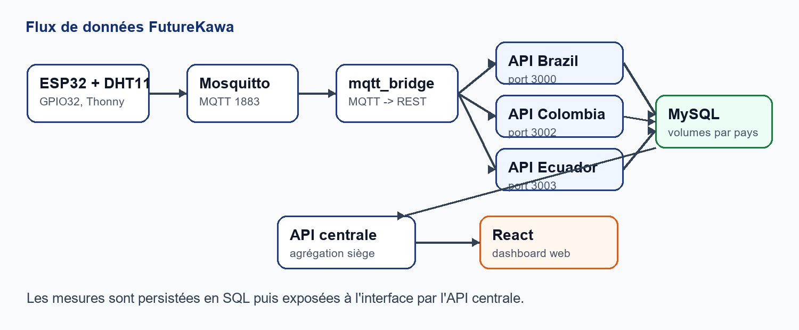

**Figure 1 - Architecture globale du flux FutureKawa.**

## 5.1 Principe général

Chaque pays dispose d'une API et d'une base de données. Le siège dispose d'une API centrale qui interroge les APIs pays. Le frontend est hébergé côté siège et consomme l'API centrale.

Cette séparation permet :

- d'isoler les données pays ;
- de refléter l'organisation métier ;
- de rendre le système extensible ;
- de faciliter l'ajout d'un nouveau pays ;
- de limiter l'impact d'une panne locale ;
- de garder une interface unifiée au siège.

## 5.2 Découpage applicatif

| Couche | Composants | Responsabilité |
| --- | --- | --- |
| IoT | ESP32, DHT11, MicroPython | Mesurer température/humidité |
| Messaging | Mosquitto MQTT | Recevoir les messages IoT |
| Bridge | mqtt_bridge Python | Transformer MQTT en HTTP REST |
| API pays | api_brazil, api_colombia, api_ecuador | Gérer stock local, mesures, alertes |
| Base pays | mysql_Brazil, mysql_Colombia, mysql_Ecuador | Persister les données |
| API centrale | api_central | Agréger les pays |
| Frontend | app_central | Afficher dashboard et pages métier |
| Tests/CI | Jenkinsfile, plan de tests | Vérifier la conformité |

## 5.3 Pourquoi Docker Compose

Docker Compose est adapté au contexte MSPR parce qu'il rend la démonstration reproductible. Une seule commande permet de lancer l'application et ses dépendances :

```powershell
docker compose --profile dev up --build -d
```

Ce choix facilite aussi l'évaluation du projet :

- les ports sont explicites ;
- les services sont nommés ;
- les bases ont des volumes ;
- les dépendances sont déclarées ;
- le broker MQTT est inclus ;
- le bridge MQTT est inclus ;
- le simulateur est inclus.

## 5.4 Tolérance aux pannes et robustesse

Le POC inclut plusieurs mécanismes simples :

- `restart: always` sur les services Docker ;
- healthchecks sur les bases MySQL ;
- volumes Docker pour conserver les données ;
- logs Docker pour diagnostiquer ;
- bridge MQTT avec boucle de reconnexion ;
- séparation des APIs pays ;
- API centrale qui route les demandes par pays.

Ce ne sont pas des mécanismes de haute disponibilité complets, mais ils démontrent une réflexion sur la stabilité et la maintenance.

<div style="page-break-after: always;"></div>

# 6. Architecture Docker et services

La solution est orchestrée avec `docker-compose.yml`.

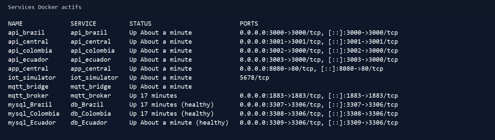

**Figure 2 - Services Docker actifs dans la version trois pays.**

## 6.1 Liste des services

| Service | Port | Rôle |
| --- | --- | --- |
| `app_central` | 8080 | Interface web React |
| `api_central` | 3001 | API siège |
| `api_brazil` | 3000 | API pays Brésil |
| `api_colombia` | 3002 | API pays Colombie |
| `api_ecuador` | 3003 | API pays Équateur |
| `mysql_Brazil` | 3307 | Base Brésil |
| `mysql_Colombia` | 3308 | Base Colombie |
| `mysql_Ecuador` | 3309 | Base Équateur |
| `mqtt_broker` | 1883 | Broker Mosquitto |
| `mqtt_bridge` | interne | Bridge MQTT vers API |
| `iot_simulator` | interne | Simulateur de mesures |

## 6.2 Variables d'environnement importantes

| Variable | Utilité |
| --- | --- |
| `BRAZIL_API_URL` | URL interne de l'API Brésil pour l'API centrale |
| `COLOMBIA_API_URL` | URL interne de l'API Colombie |
| `ECUADOR_API_URL` | URL interne de l'API Équateur |
| `MQTT_TOPIC` | Topic MQTT, par défaut `futurekawa/mesures` |
| `MQTT_BRIDGE_API_URL` | API appelée par le bridge |
| `ALERT_EMAIL_MODE` | `log`, `smtp` ou `disabled` |
| `SMTP_HOST` | Serveur SMTP |
| `SMTP_PORT` | Port SMTP |
| `SMTP_USER` | Utilisateur SMTP |
| `SMTP_PASS` | Mot de passe ou app password |
| `ALERT_EMAIL_TO` | Destinataire des alertes |

## 6.3 Seuils par pays

Le sujet demande des conditions idéales par pays :

- Brésil : 29 °C / 55 % ;
- Équateur : 31 °C / 60 % ;
- Colombie : 26 °C / 80 % ;
- tolérance : ±3 °C et ±2 %.

La solution utilise des variables d'environnement pour configurer ces seuils par API pays.

| Pays | Température conforme | Humidité conforme |
| --- | --- | --- |
| Brésil | 26 °C à 32 °C | 53 % à 57 % |
| Colombie | 23 °C à 29 °C | 78 % à 82 % |
| Équateur | 28 °C à 34 °C | 58 % à 62 % |

Cette amélioration évite de coder une règle unique trop générique et rapproche la solution du cahier des charges.

## 6.4 Commandes principales

Lancement complet :

```powershell
docker compose --profile dev up --build -d
```

Vérification :

```powershell
docker compose ps
```

Arrêt :

```powershell
docker compose --profile dev down
```

<div style="page-break-after: always;"></div>

# 7. Modèle de données SQL

Le modèle de données est volontairement simple, car le but du POC est de démontrer la chaîne fonctionnelle complète.

## 7.1 Tables principales

| Table | Description |
| --- | --- |
| `exploitations` | Exploitations caféières |
| `entrepots` | Entrepôts rattachés aux exploitations |
| `lots` | Lots de café stockés |
| `mesures` | Mesures température/humidité |

## 7.2 Relation entre les entités

```text
Exploitation 1,n Entrepôt
Entrepôt 1,n Lot
Entrepôt 1,n Mesure
```

Un entrepôt est donc le point central du modèle : il relie les lots physiques et les mesures IoT.

## 7.3 Table exploitations

La table `exploitations` contient :

- `id_exploitation` ;
- `nom`.

Elle sert à regrouper les entrepôts par zone métier.

## 7.4 Table entrepots

La table `entrepots` contient :

- `id_entrepot` ;
- `id_exploitation` ;
- `nom`.

Elle permet d'afficher les entrepôts d'une exploitation sélectionnée.

## 7.5 Table lots

La table `lots` contient :

- `id_lot` ;
- `id_entrepot` ;
- `date_stockage` ;
- `statut`.

Le statut permet de signaler un lot conforme, en alerte ou périmé.

## 7.6 Table mesures

La table `mesures` contient :

- `id_mesure` ;
- `id_entrepot` ;
- `temperature` ;
- `humidite` ;
- `statut` ;
- `timestamp`.

Chaque mesure est historisée. Le frontend peut donc afficher les dernières mesures et les courbes.

## 7.7 Justification du choix SQL

Le sujet demande une persistance SQL. MySQL est adapté car :

- les données sont relationnelles ;
- les liens exploitation/entrepôt/lot/mesure sont simples ;
- Docker fournit une image officielle stable ;
- TypeORM s'intègre facilement avec NestJS ;
- les volumes Docker conservent les données.

<div style="page-break-after: always;"></div>

# 8. API pays

L'API pays est développée avec NestJS. Elle est réutilisée pour les trois pays. La différence entre les pays vient principalement des variables d'environnement et de la base connectée.

## 8.1 Responsabilités

L'API pays est responsable de :

- gérer les exploitations ;
- gérer les entrepôts ;
- gérer les lots ;
- gérer les mesures ;
- calculer les statuts ;
- déclencher les alertes ;
- envoyer ou journaliser les notifications ;
- exposer les données à l'API centrale.

## 8.2 Routes exploitations

```text
GET    /exploitations
GET    /exploitations/:id
POST   /exploitations
PUT    /exploitations/:id
DELETE /exploitations/:id
```

## 8.3 Routes entrepôts

```text
GET    /entrepots
GET    /entrepots/exploitation/:id
GET    /entrepots/:id
POST   /entrepots
PUT    /entrepots/:id
DELETE /entrepots/:id
```

## 8.4 Routes lots

```text
GET    /lots
GET    /lots/expired
GET    /lots/entrepot/:id
GET    /lots/:id
POST   /lots
PUT    /lots/:id
DELETE /lots/:id
```

## 8.5 Routes mesures

```text
GET  /mesures
GET  /mesures/entrepot/:id/latest
GET  /mesures/entrepot/:id
GET  /mesures/alerts
GET  /mesures/:id
POST /mesures
```

## 8.6 Calcul du statut mesure

Lorsqu'une mesure est reçue, l'API compare la température et l'humidité aux seuils du pays. Si les deux valeurs sont dans les plages configurées, la mesure est conforme. Sinon, elle devient `en alerte`.

Exemple pour Brazil :

```text
Température cible : 29 °C
Tolérance : +/- 3 °C
Plage conforme : 26 °C à 32 °C

Humidité cible : 55 %
Tolérance : +/- 2 %
Plage conforme : 53 % à 57 %
```

Une mesure `34 °C / 84 %` est donc en alerte.

## 8.7 Calcul du statut lot

La règle des lots est indépendante des mesures. Le lot devient :

- `conforme` si sa date de stockage est récente ;
- `en alerte` à partir d'une période de vigilance ;
- `périmé` au-delà de 365 jours.

Cette règle permet de couvrir le besoin du sujet concernant les lots trop anciens.

<div style="page-break-after: always;"></div>

# 9. API centrale siège

L'API centrale représente le siège de FutureKawa. Elle ne remplace pas les APIs pays : elle les agrège.

## 9.1 Objectif

Le siège doit pouvoir consulter les données des pays depuis une interface unique. L'API centrale expose donc des routes préfixées par pays :

```text
/:country/exploitations
/:country/entrepots
/:country/lots
/:country/mesures
```

où `country` peut valoir :

- `brazil` ;
- `colombia` ;
- `ecuador`.

## 9.2 Exemple de flux

Quand le frontend demande :

```text
GET http://localhost:3001/brazil/entrepots
```

L'API centrale appelle en interne :

```text
http://api_brazil:3000/entrepots
```

Le frontend ne connaît donc pas directement les APIs pays. Il parle au siège.

## 9.3 Preuve Équateur

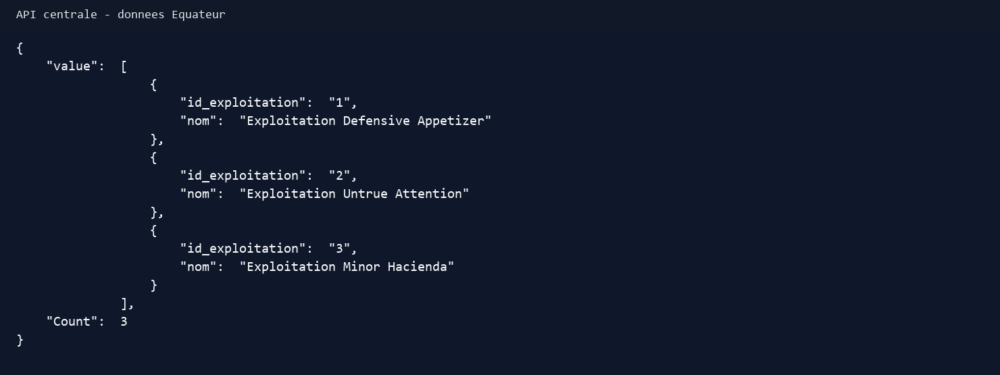

**Figure 3 - L'API centrale expose les exploitations Équateur.**

## 9.4 Intérêt architectural

Ce découpage correspond au sujet car :

- les pays restent autonomes ;
- le siège consolide les informations ;
- le frontend ne dépend pas directement de chaque backend pays ;
- l'ajout d'un pays se fait par une nouvelle API pays + une URL de mapping ;
- le modèle peut évoluer vers une architecture micro-services.

## 9.5 Limites connues

L'API centrale est aujourd'hui une passerelle simple. Pour une industrialisation, il serait pertinent d'ajouter :

- authentification ;
- contrôle des droits ;
- gestion des erreurs pays plus fine ;
- timeout configurable ;
- cache léger ;
- logs structurés ;
- documentation OpenAPI.

Ces points ne bloquent pas la validation du POC, mais ils sont importants pour une mise en production.

<div style="page-break-after: always;"></div>

# 10. Module IoT ESP32 + DHT11

Le module IoT répond à l'exigence de développement embarqué / IoT de la grille. Le choix final est MicroPython sur ESP32 avec Thonny.

## 10.1 Matériel

Le matériel utilisé :

- microcontrôleur ESP32 ;
- capteur DHT11 température + humidité ;
- câbles de connexion ;
- connexion USB au PC ;
- Thonny IDE.

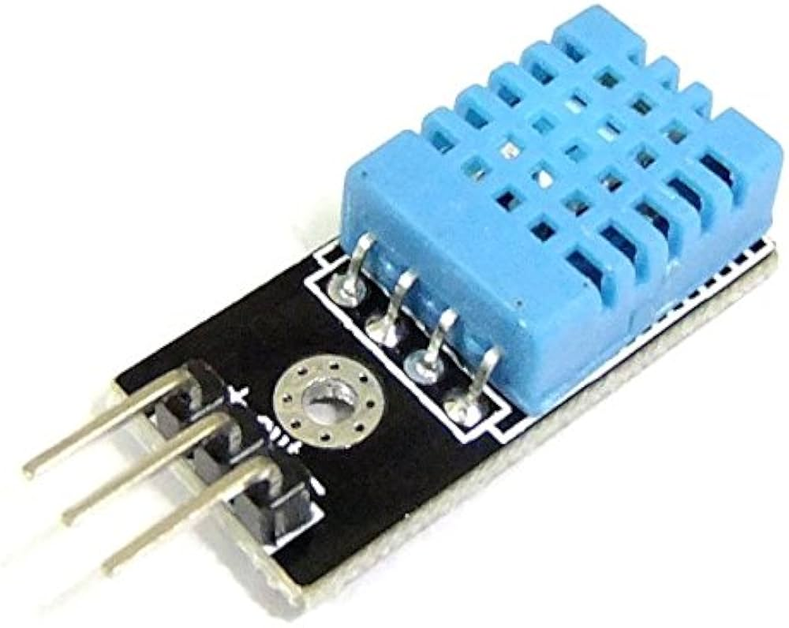

**Figure 4 - Capteur DHT11 utilisé pour mesurer la température et l'humidité.**

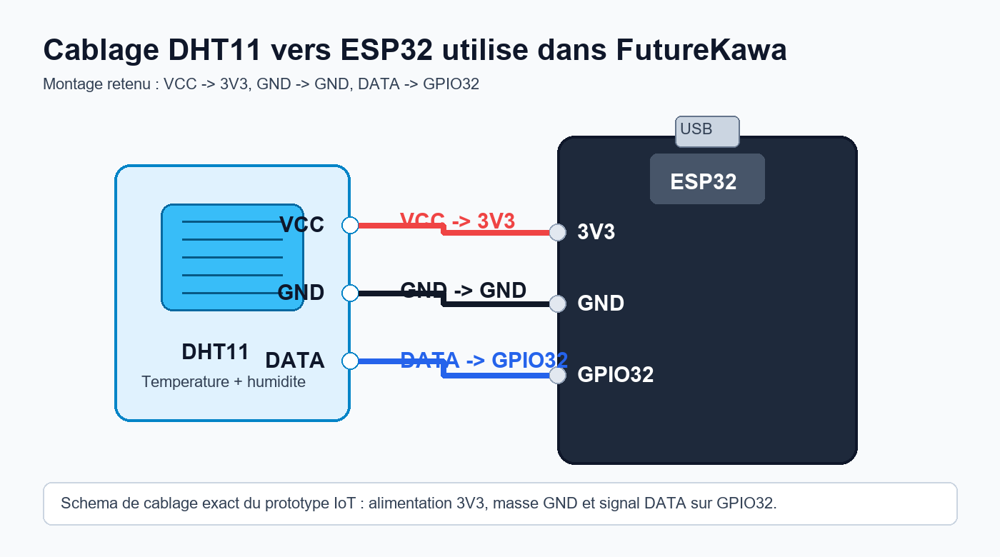

**Figure 5 - Schéma exact du câblage DHT11 vers ESP32 : VCC vers 3V3, GND vers GND, DATA vers GPIO32.**

Faute de photo fiable de la carte ESP32 réellement utilisée, le rapport privilégie ce schéma de câblage exact. Le projet présenté utilise bien un ESP32 avec MicroPython et le signal DATA du DHT11 sur GPIO32.

## 10.2 Branchement

Le branchement retenu :

```text
DHT11 VCC  -> ESP32 3V3
DHT11 GND  -> ESP32 GND
DHT11 DATA -> ESP32 GPIO32
```

## 10.3 Pourquoi MicroPython

MicroPython a été retenu parce que le cours et le professeur l'ont explicitement orienté. Il présente plusieurs avantages pédagogiques :

- code court ;
- lisible ;
- compatible Thonny ;
- simple à téléverser ;
- adapté à une démonstration ;
- accès direct aux modules `machine`, `network`, `dht`.

Le fichier principal est :

```text
iot/esp32-dht11/micropython/main_mqtt.py
```

## 10.4 Fonctionnement du script

Le script :

1. charge la configuration Wi-Fi et MQTT ;
2. initialise le capteur DHT11 sur GPIO32 ;
3. se connecte au Wi-Fi ;
4. se connecte au broker MQTT ;
5. lit la température et l'humidité ;
6. construit un JSON ;
7. publie ce JSON sur `futurekawa/mesures` ;
8. recommence toutes les `INTERVAL_SECONDS`.

Payload envoyé :

```json
{"id_entrepot":1,"temperature":26.5,"humidite":55}
```

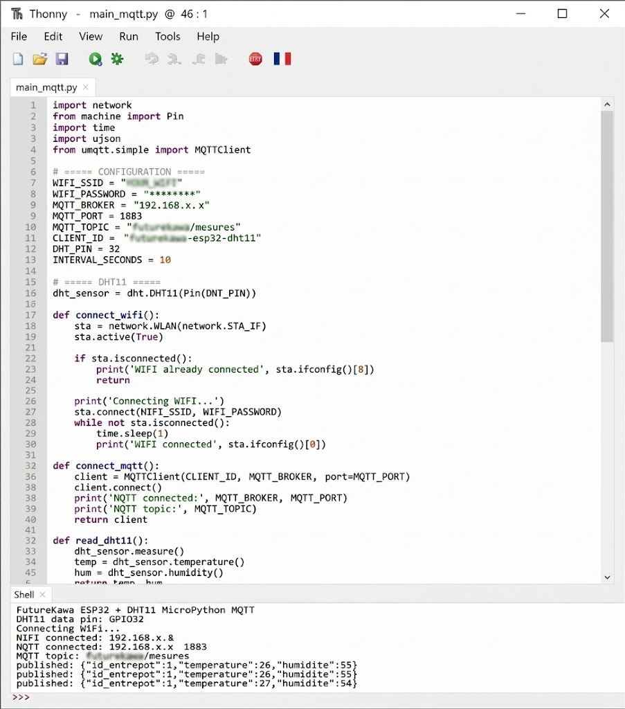

**Figure 6 - Exécution du script MicroPython dans Thonny : connexion Wi-Fi, connexion MQTT et publication des mesures DHT11 au format JSON.**

## 10.5 Gestion des erreurs

Le script inclut une gestion simple des erreurs :

- si le capteur ou MQTT échoue, l'erreur est affichée ;
- le client MQTT est déconnecté ;
- le script attend ;
- il tente de reconnecter le Wi-Fi et MQTT.

Pour un POC, cela suffit à montrer une réflexion sur la robustesse. En production, on ajouterait une stratégie plus complète : compteur d'échecs, redémarrage contrôlé, journalisation locale, watchdog.

<div style="page-break-after: always;"></div>

# 11. Protocole MQTT et bridge

Le sujet demande que les relevés IoT soient transmis via un broker MQTT. La solution utilise Mosquitto.

## 11.1 Topic MQTT

```text
futurekawa/mesures
```

## 11.2 Format du payload

```json
{
  "id_entrepot": 1,
  "temperature": 26.5,
  "humidite": 55
}
```

## 11.3 Rôle de Mosquitto

Mosquitto reçoit les messages publiés par l'ESP32 ou par le test `mosquitto_pub`.

## 11.4 Rôle du bridge

Le service `mqtt_bridge` :

1. se connecte à Mosquitto ;
2. s'abonne au topic `futurekawa/mesures` ;
3. reçoit le payload ;
4. le normalise ;
5. l'envoie en HTTP POST vers l'API pays ;
6. affiche le résultat dans les logs.

Cette séparation est logique : l'API pays reste REST, et le bridge fait le lien entre monde IoT et monde applicatif.

## 11.5 Preuve MQTT

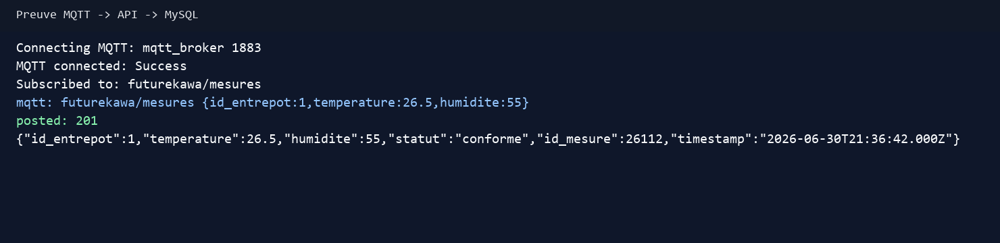

**Figure 7 - Le bridge reçoit une mesure MQTT et obtient une réponse HTTP 201.**

## 11.6 Preuve API centrale après persistance

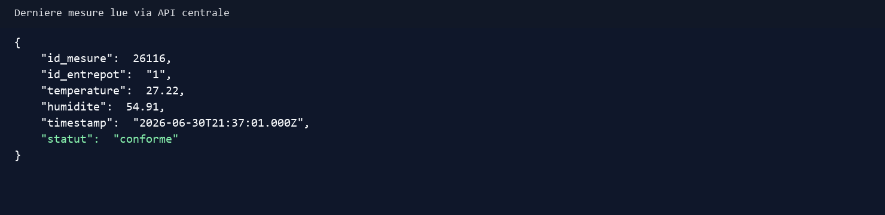

**Figure 8 - Dernière mesure lue via l'API centrale.**

## 11.7 Test sans ESP32

La commande suivante permet de tester sans matériel :

```powershell
docker exec mqtt_broker mosquitto_pub -h localhost -p 1883 -t futurekawa/mesures -m "{id_entrepot:1,temperature:26.5,humidite:55}"
```

Résultat attendu :

```text
mqtt: futurekawa/mesures {id_entrepot:1,temperature:26.5,humidite:55}
posted: 201 ...
```

Ce test est important car il rend la démonstration reproductible même si le capteur n'est pas disponible.

<div style="page-break-after: always;"></div>

# 12. Interface web React

L'interface web est la partie visible du projet. Elle doit être compréhensible par un utilisateur métier et utile pour la soutenance.

## 12.1 Dashboard

Le dashboard permet de sélectionner un pays sur la carte. Il donne un premier niveau de contexte.

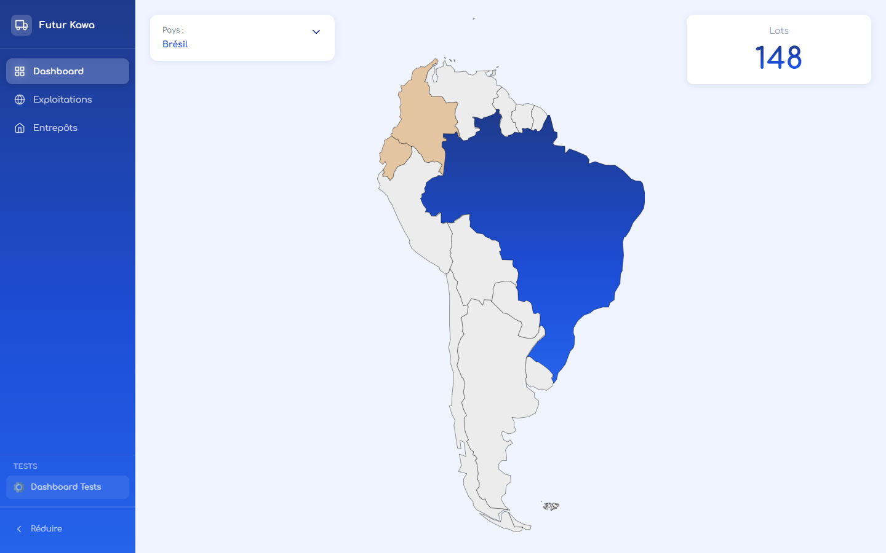

**Figure 9 - Dashboard avec sélection du Brésil.**

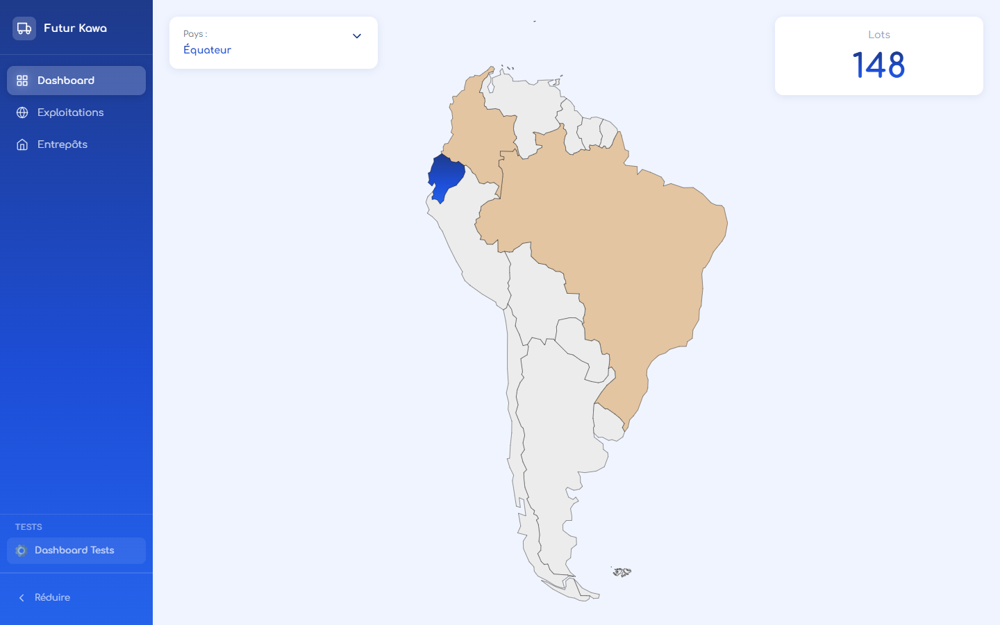

**Figure 10 - Dashboard avec sélection de l'Équateur.**

## 12.2 Page Exploitations

La page Exploitations permet de :

- choisir le pays ;
- choisir l'exploitation ;
- choisir l'entrepôt ;
- afficher le nombre de lots ;
- afficher la température ;
- afficher l'humidité ;
- afficher l'évolution des mesures.

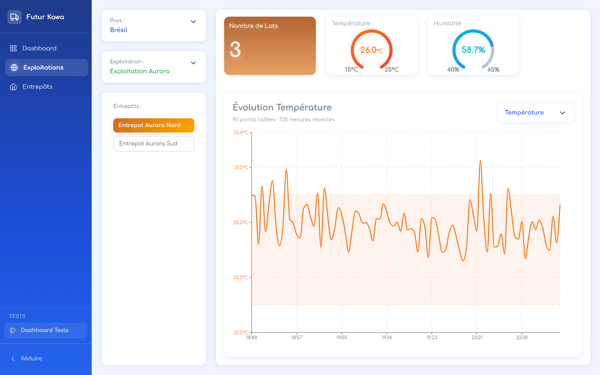

**Figure 11 - Page Exploitations avec jauges et graphe.**

## 12.3 Correction du graphe

Un problème visuel avait été observé : le graphe contenait trop de points et devenait illisible. La correction consiste à :

- limiter le nombre brut de mesures récentes ;
- regrouper les mesures en buckets lorsque le volume est trop grand ;
- afficher une moyenne par bucket ;
- adapter le domaine Y aux valeurs visibles ;
- afficher les seuils sous forme de zone de référence.

Cette correction est importante parce qu'elle montre que l'interface n'est pas seulement fonctionnelle, mais aussi exploitable par un utilisateur.

## 12.4 Page Entrepôts

La page Entrepôts fournit une vue plus opérationnelle :

- liste des entrepôts ;
- filtre par statut ;
- recherche ;
- détail d'un entrepôt ;
- lots associés ;
- dernière mesure ;
- historique récent ;
- alertes visibles dans le contexte.

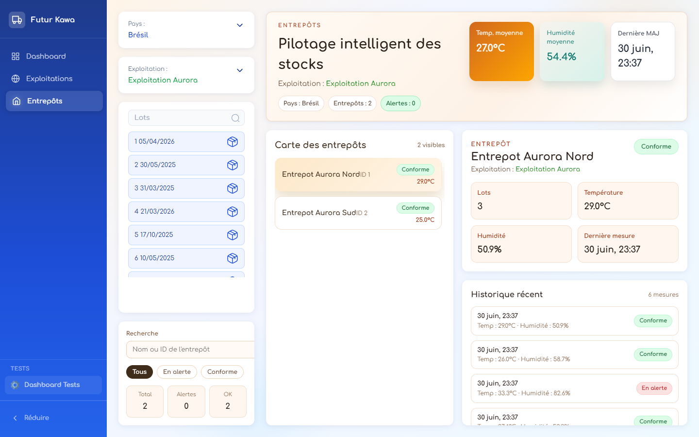

**Figure 12 - Page Entrepôts avec historique et contexte d'alerte.**

## 12.5 Choix UX

Les alertes ne sont pas pensées comme de simples messages isolés. L'idée retenue est qu'une alerte doit ramener l'utilisateur vers le contexte métier : pays, exploitation, entrepôt, historique. Cela évite qu'un responsable voie seulement "alerte" sans comprendre la cause.

<div style="page-break-after: always;"></div>

# 13. Gestion des alertes

La gestion des alertes couvre deux familles :

- alertes sur mesures IoT ;
- alertes sur lots.

## 13.1 Alertes mesures

Une mesure devient `en alerte` si la température ou l'humidité sort de la plage configurée pour le pays.

Exemple Brazil :

```text
Température conforme : 26 à 32 °C
Humidité conforme : 53 à 57 %
```

Une mesure `34 °C / 84 %` déclenche donc une alerte.

## 13.2 Alertes lots

Un lot peut devenir :

- `en alerte` lorsqu'il approche de la limite d'ancienneté ;
- `périmé` lorsqu'il dépasse 365 jours.

Le sujet demande explicitement de gérer les lots trop anciens. Cette règle couvre ce besoin.

## 13.3 Modes d'envoi

Le service d'alerte supporte trois modes :

| Mode | Description |
| --- | --- |
| `log` | Écrit le contenu de l'e-mail dans les logs Docker |
| `smtp` | Envoie un vrai e-mail |
| `disabled` | Désactive les notifications |

## 13.4 Variables SMTP

Pour un vrai envoi :

```env
ALERT_EMAIL_MODE=smtp
SMTP_HOST=smtp.gmail.com
SMTP_PORT=587
SMTP_SECURE=false
SMTP_USER=adresse@gmail.com
SMTP_PASS=app_password
ALERT_EMAIL_TO=destinataire@gmail.com
ALERT_EMAIL_FROM=adresse@gmail.com
```

Les secrets SMTP ne doivent pas être commit dans Git.

## 13.5 Preuve log

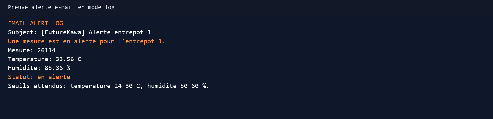

**Figure 13 - Exemple de contenu d'alerte journalisé dans Docker.**

## 13.6 Preuve SMTP

Le mode SMTP réel a été testé localement après configuration du fichier `.env`. Le comportement observé est :

```text
Email alert sent to ...
```


**Figure 14 - Boîte mail montrant plusieurs alertes FutureKawa reçues automatiquement.**

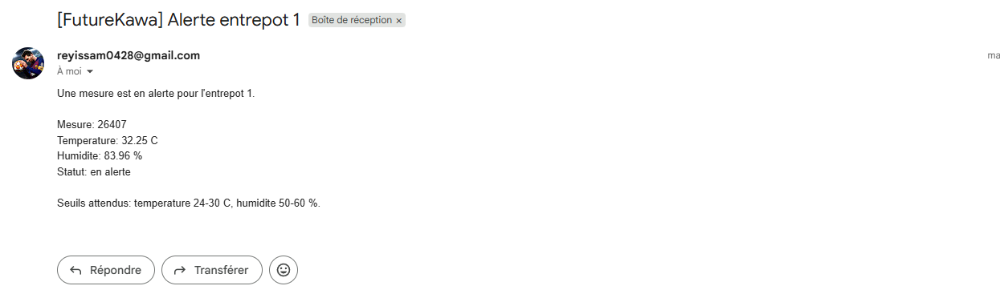

**Figure 15 - Détail d'une alerte e-mail avec mesure, température, humidité, statut et seuils attendus.**

Cette preuve complète le mode `log` : le système peut écrire l'alerte dans Docker pour le développement et envoyer un vrai e-mail en mode SMTP.

<div style="page-break-after: always;"></div>

# 14. Gestion des lots et logique FIFO

Le sujet insiste sur la traçabilité et la rotation des lots. Le projet gère les lots en base SQL et les expose dans l'interface.

## 14.1 Données d'un lot

Un lot contient :

- un identifiant ;
- un entrepôt ;
- une date de stockage ;
- un statut.

## 14.2 FIFO

La logique FIFO consiste à traiter les lots les plus anciens en premier. Dans l'interface, les dates de stockage permettent d'identifier les lots à prioriser.

## 14.3 Statuts

| Statut | Signification |
| --- | --- |
| `conforme` | Le lot ne présente pas de risque détecté |
| `en alerte` | Le lot approche d'une limite métier |
| `périmé` | Le lot dépasse la limite de stockage |

## 14.4 Intérêt pour FutureKawa

La gestion des lots répond à plusieurs enjeux :

- traçabilité ;
- qualité ;
- réduction des pertes ;
- auditabilité ;
- préparation des expéditions ;
- respect des engagements clients.

## 14.5 Évolutions possibles

Pour une version industrielle, on pourrait ajouter :

- numéro de lot métier ;
- origine parcelle ;
- qualité café ;
- poids ;
- client réservé ;
- historique de mouvements ;
- export CSV ;
- code QR ;
- gestion des expéditions.

Ces évolutions dépassent le POC mais montrent la trajectoire produit.

<div style="page-break-after: always;"></div>

# 15. Tests et validation

Le plan de tests se trouve dans :

```text
docs/tests/plan_de_tests.md
```

La stratégie de tests automatisés et le suivi des anomalies sont documentés dans :

```text
docs/tests/strategie_tests_automatises.md
docs/tests/anomalies_retests.md
```

## 15.1 Objectif des tests

Les tests doivent vérifier le chemin critique :

```text
Docker -> API -> MQTT -> base SQL -> API centrale -> frontend -> alertes
```

Ils couvrent aussi les règles métier critiques : calcul du statut mesure, seuils température/humidité, mapping ERP stock et mapping ERP qualité.

## 15.2 Tests automatisés

Commande :

```powershell
cd country/api
npm test
```

Résultat obtenu :

```text
FutureKawa automated tests passed
```

Ces tests automatisés vérifient :

- une mesure conforme ;
- une mesure hors seuil ;
- une mesure incomplète ;
- la transformation d'un lot vers un payload ERP stock ;
- la transformation d'une mesure en alerte vers un payload ERP qualité.

## 15.3 Résultats de vérification

Les vérifications suivantes ont été exécutées localement le 1 juillet 2026 après l'ajout du module ERP, des tests automatisés et des mises à jour Jenkins.

| Vérification | Commande | Résultat |
| --- | --- | --- |
| Validation Docker Compose | `docker compose --profile dev config --quiet` | OK |
| Tests automatisés API pays | `npm test` dans `country/api` | OK - `FutureKawa automated tests passed` |
| Build API pays | `npm run build` dans `country/api` | OK |
| Build API centrale | `npm run build` dans `central/api` | OK |
| Build frontend | `npm run build` dans `central/app` | OK |

Cette vérification complète les tests manuels : elle prouve que les règles métier critiques, le mapping ERP et les builds applicatifs sont reproductibles par commande.

## 15.4 Positionnement E2E navigateur

Le dépôt contient un script Playwright utilisé pour produire des captures de preuve (`docs/rendu/capture_evidence.py`). En revanche, il n'existe pas encore de suite Playwright ou Cypress stable intégrée au frontend et exécutée automatiquement dans Jenkins.

Pour éviter de survalider le critère, le test E2E navigateur est donc présenté comme un scénario manuel contrôlé :

1. démarrer Docker Compose ;
2. ouvrir le frontend ;
3. sélectionner le Brésil ;
4. ouvrir une exploitation ;
5. consulter les mesures ;
6. cliquer une alerte ;
7. vérifier la navigation vers la page exploitations ;
8. contrôler que l'API centrale retourne les mêmes données.

Cette limite est volontairement documentée : l'automatisation E2E complète reste une amélioration d'industrialisation, alors que les tests automatisés actuels sécurisent déjà les règles métier critiques et le mapping ERP.

## 15.5 T01 - Démarrage

Commande :

```powershell
docker compose --profile dev up --build -d
docker compose ps
```

Résultat attendu :

- APIs pays up ;
- API centrale up ;
- frontend up ;
- bases MySQL healthy ;
- broker MQTT up ;
- bridge up.

## 15.6 T02 - Mesure conforme

Commande :

```powershell
Invoke-RestMethod -Method Post -Uri "http://localhost:3000/mesures" -ContentType "application/json" -Body '{"id_entrepot":1,"temperature":26.5,"humidite":55}'
```

Résultat attendu :

- HTTP 201 ;
- statut conforme pour Brazil ;
- mesure persistée.

## 15.7 T03 - Mesure en alerte

Commande :

```powershell
Invoke-RestMethod -Method Post -Uri "http://localhost:3000/mesures" -ContentType "application/json" -Body '{"id_entrepot":1,"temperature":34,"humidite":84}'
```

Résultat attendu :

- HTTP 201 ;
- statut `en alerte` ;
- notification log ou SMTP.

## 15.8 T04 - MQTT

Commande :

```powershell
docker exec mqtt_broker mosquitto_pub -h localhost -p 1883 -t futurekawa/mesures -m "{id_entrepot:1,temperature:26.5,humidite:55}"
docker logs --tail 30 mqtt_bridge
```

Résultat attendu :

- message reçu ;
- POST API ;
- HTTP 201.

## 15.9 T05 - Interface web

URL :

```text
http://localhost:8080
```

Étapes :

1. sélectionner Brésil ;
2. ouvrir Exploitations ;
3. choisir une exploitation ;
4. choisir un entrepôt ;
5. vérifier température/humidité ;
6. ouvrir Entrepôts ;
7. vérifier historique récent ;
8. vérifier alertes.

## 15.10 T06 - Multi-pays

Commandes :

```powershell
Invoke-RestMethod -Uri "http://localhost:3001/brazil/exploitations"
Invoke-RestMethod -Uri "http://localhost:3001/colombia/exploitations"
Invoke-RestMethod -Uri "http://localhost:3001/ecuador/exploitations"
```

Résultat attendu :

- les trois routes répondent.

<div style="page-break-after: always;"></div>

# 16. Intégration continue Jenkins

Le sujet demande une intégration continue avec un outil comme Jenkins. Le projet contient un `Jenkinsfile` à la racine.

## 16.1 Objectif

Le pipeline doit détecter rapidement :

- une configuration Docker invalide ;
- une règle métier qui régresse ;
- une API qui ne build plus ;
- un frontend qui ne build plus ;
- un bridge qui ne se construit plus.

## 16.2 Étapes Jenkins

Le pipeline contient :

1. checkout du dépôt ;
2. validation Docker Compose ;
3. tests automatisés de l'API pays ;
4. build de l'API pays ;
5. build de l'API centrale ;
6. contrôle TypeScript et build du frontend ;
7. build de l'image MQTT bridge ;
8. archivage des artefacts de build.

## 16.3 Commandes équivalentes localement

```powershell
docker compose --profile dev config --quiet
cd country/api
npm ci
npm test
npm run build
cd ../../central/api
npm ci
npm run build
cd ../app
npm ci
npm run build
cd ../../
docker compose --profile dev build mqtt_bridge
```

## 16.4 Comment créer le job Jenkins

Dans Jenkins :

1. créer un nouvel item ;
2. choisir Pipeline ;
3. sélectionner Pipeline script from SCM ;
4. mettre l'URL GitHub du projet ;
5. sélectionner la branche ;
6. mettre `Jenkinsfile` comme script path ;
7. lancer Build Now.

## 16.5 Preuves Jenkins

Les captures Jenkins ci-dessous renforcent la validation de la grille, car elles montrent à la fois le job, les stages et la console de sortie.

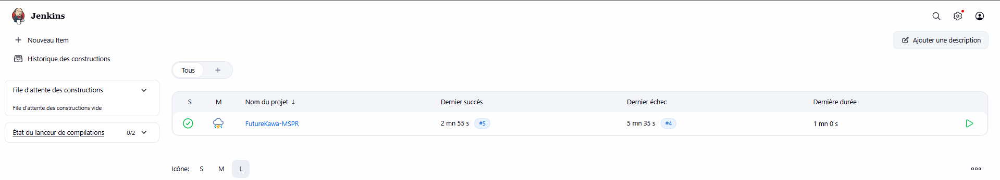

**Figure 16 - Job Jenkins FutureKawa-MSPR avec dernier build en succès.**

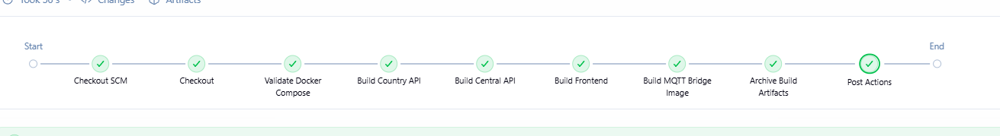

**Figure 17 - Pipeline Jenkins après mise à jour CI : validation Docker Compose, builds applicatifs, image MQTT bridge et archivage des artefacts.**

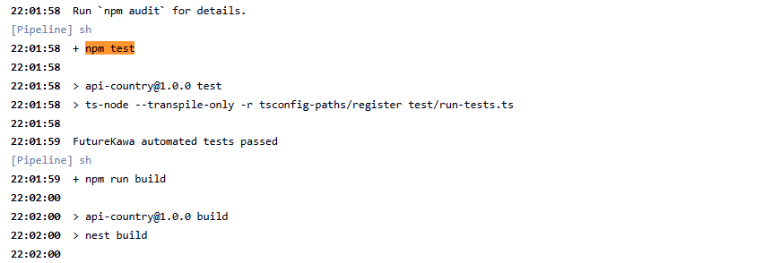

**Figure 18 - Console Jenkins montrant l'exécution de `npm test` et le résultat `FutureKawa automated tests passed`.**

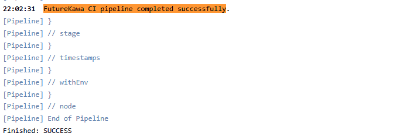

**Figure 19 - Console Jenkins montrant la fin du pipeline avec `FutureKawa CI pipeline completed successfully`.**

Ces preuves montrent que le projet ne se limite pas à une exécution locale manuelle : il possède une chaîne de validation automatisée.

<div style="page-break-after: always;"></div>

# 17. Documentation utilisateur

La grille demande une documentation utilisateur orientée métier. Cette section peut être utilisée comme base.

## 17.1 Accéder à l'application

Après lancement Docker :

```text
http://localhost:8080
```

## 17.2 Sélectionner un pays

Depuis le Dashboard :

1. cliquer sur le pays sur la carte ;
2. vérifier que la carte pays affiche le pays sélectionné ;
3. aller dans Exploitations ou Entrepôts.

## 17.3 Consulter une exploitation

Dans Exploitations :

1. choisir le pays ;
2. choisir l'exploitation ;
3. choisir l'entrepôt ;
4. lire le nombre de lots ;
5. lire la température ;
6. lire l'humidité ;
7. lire le graphe d'évolution.

## 17.4 Consulter un entrepôt

Dans Entrepôts :

1. choisir le pays ;
2. choisir l'exploitation ;
3. sélectionner un entrepôt dans la liste ;
4. consulter les métriques ;
5. consulter l'historique récent.

## 17.5 Comprendre une alerte

Une alerte indique qu'une condition sort de la plage acceptable. L'utilisateur doit :

1. identifier l'entrepôt ;
2. lire la température et l'humidité ;
3. vérifier l'historique ;
4. contrôler physiquement l'entrepôt si nécessaire ;
5. vérifier les lots sensibles ;
6. noter l'action réalisée.

## 17.6 FAQ utilisateur

### Je ne vois aucune donnée

Vérifier :

- Docker est lancé ;
- le pays est sélectionné ;
- l'exploitation est sélectionnée ;
- l'entrepôt est sélectionné ;
- l'API centrale répond.

### Le graphe est vide

Vérifier qu'il existe des mesures pour l'entrepôt sélectionné.

### Je reçois une alerte

Lire le détail dans l'interface et vérifier les conditions réelles de l'entrepôt.

<div style="page-break-after: always;"></div>

# 18. Conduite du changement

La conduite du changement est nécessaire parce que l'outil modifie les habitudes des équipes. Le projet ne doit pas être perçu comme un simple tableau de bord technique, mais comme un support opérationnel.

## 18.1 Axe informer

Actions :

- présenter le projet ;
- expliquer les risques de stockage ;
- montrer le rôle des capteurs ;
- présenter les bénéfices ;
- expliquer les limites du POC.

Livrables :

- note de lancement ;
- schéma du flux ;
- planning pilote.

## 18.2 Axe communiquer

Actions :

- organiser une démonstration ;
- montrer une mesure conforme ;
- montrer une mesure en alerte ;
- partager les contacts support ;
- expliquer comment remonter un problème.

Canaux :

- réunion Teams ;
- support PDF ;
- README ;
- fiche réflexe.

## 18.3 Axe former

Publics à former :

- responsables d'exploitation ;
- responsables entrepôt ;
- référents qualité ;
- équipe SI.

Contenu :

- sélection pays ;
- lecture des alertes ;
- consultation des lots ;
- consultation des historiques ;
- relance Docker ;
- lecture des logs MQTT.

## 18.4 Axe faire participer

Actions :

- recueillir les retours ;
- ajuster les seuils ;
- choisir des référents ;
- organiser un pilote ;
- valider la généralisation.

## 18.5 Application du modèle de transition de William Bridges

Le modèle de William Bridges complète les quatre axes précédents. Il distingue la transition vécue par les utilisateurs en trois moments : accepter la fin d'anciennes habitudes, traverser une zone d'incertitude, puis adopter une nouvelle manière de travailler.

| Étape Bridges | Risque utilisateur | Action FutureKawa | Responsable | Indicateur |
| --- | --- | --- | --- | --- |
| Fin, perte, abandon | Les responsables continuent à suivre les lots uniquement avec des fichiers locaux | Expliquer pourquoi les anciennes pratiques ne suffisent plus pour les alertes température/humidité | Direction qualité + SI | Nombre de sites ayant arrêté le suivi manuel seul |
| Zone neutre | Les utilisateurs hésitent entre l'ancien suivi et le nouveau dashboard | Organiser un pilote sur un pays, recueillir les retours, ajuster les seuils et corriger les irritants | Référent exploitation + SI | Nombre de retours traités et anomalies re-testées |
| Nouveau départ, adoption | L'outil est vu comme une contrainte technique supplémentaire | Nommer des référents, former les équipes, montrer les alertes résolues grâce au système | Responsable exploitation | Taux d'utilisation du dashboard et temps moyen de réaction |

Cette approche permet de ne pas limiter la conduite du changement à une communication descendante. Les utilisateurs participent au réglage des seuils, à la validation des alertes et à la priorisation des améliorations.

## 18.6 Indicateurs de réussite

| Indicateur | Objectif |
| --- | --- |
| Nombre de mesures reçues par jour | Vérifier le bon fonctionnement IoT |
| Nombre d'alertes traitées | Suivre la réactivité |
| Temps moyen de réaction | Mesurer l'efficacité opérationnelle |
| Taux de disponibilité MQTT | Suivre la robustesse technique |
| Satisfaction des responsables | Mesurer l'adoption |

<div style="page-break-after: always;"></div>

# 19. Préparation phase 2 automatisation

Le sujet demande un prototype de schéma pour une future automatisation des équipements d'entrepôt.

## 19.1 Objectif phase 2

La phase 2 consisterait à utiliser les mesures pour piloter :

- chauffage ;
- humidification ;
- aération.

## 19.2 Schéma de principe

```text
Capteur DHT11
  -> ESP32
  -> MQTT
  -> API pays
  -> moteur de décision
  -> actionneur
  -> journalisation
  -> supervision web
```

## 19.3 Cas nominal

Si l'humidité est trop basse :

1. la mesure est reçue ;
2. le statut devient en alerte ;
3. l'utilisateur est notifié ;
4. en phase 2, un humidificateur pourrait être activé ;
5. la mesure suivante confirme ou non le retour à la normale.

## 19.4 Cas dégradé

Si le capteur renvoie une valeur incohérente :

- ne pas déclencher automatiquement un actionneur ;
- marquer la mesure comme suspecte ;
- demander une vérification humaine ;
- journaliser l'anomalie.

## 19.5 Sécurité

La phase 2 doit intégrer :

- mode manuel ;
- arrêt d'urgence ;
- validation humaine pour certains seuils ;
- historisation des actions ;
- test régulier des capteurs ;
- gestion des pannes réseau ;
- règles d'escalade.

## 19.6 Questionnaire phase 2

Le fichier suivant contient les questions de cadrage :

```text
docs/cadrage/questionnaire_phase_2.md
```

Il couvre :

- besoins métier ;
- sécurité ;
- maintenance ;
- déploiement ;
- indicateurs de réussite.

<div style="page-break-after: always;"></div>

# 20. Sécurité, robustesse et limites

## 20.1 Sécurité actuelle

Le POC protège déjà certains points :

- les secrets SMTP ne sont pas commit ;
- les variables d'environnement configurent les accès ;
- Docker isole les services ;
- les bases sont séparées par pays ;
- le frontend ne contacte pas directement les APIs pays ;
- les exports ERP sensibles sont protégés par clé API ;
- les exports ERP utilisent un contrôle de rôle simple avec `x-user-role` ;
- les accès ERP autorisés ou refusés sont journalisés dans les logs de l'API.

Le module ERP attend les en-têtes suivants pour les routes sensibles :

```text
x-api-key: futurekawa-demo-key
x-user-role: stock
```

ou :

```text
x-api-key: futurekawa-demo-key
x-user-role: quality
```

La route `/erp/health` reste publique afin de permettre une supervision simple du connecteur. Les routes `/erp/stock-movements` et `/erp/quality-alerts` nécessitent une clé API et un rôle autorisé.

## 20.2 Limites de sécurité

Pour une mise en production, il faudrait ajouter :

- authentification utilisateur complète, par exemple JWT ou SSO ;
- gestion centralisée des rôles utilisateurs ;
- HTTPS ;
- rotation des secrets ;
- validation stricte des payloads ;
- rate limiting ;
- logs structurés ;
- audit des actions utilisateur.

## 20.3 Robustesse actuelle

Le projet inclut :

- volumes MySQL ;
- healthchecks MySQL ;
- redémarrage automatique ;
- bridge MQTT avec reconnexion ;
- simulateur ;
- tests manuels ;
- CI Jenkins.

## 20.4 Limites fonctionnelles

Le projet ne couvre pas encore :

- un ERP réel ;
- une intégration Salesforce/SAP/MSDynamics ;
- un module complet de comptes utilisateurs et permissions applicatives ;
- l'export de rapports métier ;
- les actionneurs physiques de phase 2 ;
- un dashboard décisionnel complet.

## 20.5 Justification concernant l'ERP

La grille mentionne le développement dans un progiciel intégré. Le projet ne doit pas être présenté comme une intégration réelle SAP, Microsoft Dynamics ou Salesforce. La réalisation correspond à un **adaptateur ERP simulé dans le cadre du POC**, ajouté côté API pays pour exposer les données FutureKawa dans un format consommable par un système de gestion.

```text
country/api/src/erp/
```

L'adaptateur expose des endpoints dédiés :

```text
GET /erp/health
GET /erp/stock-movements
GET /erp/quality-alerts
```

Les routes `/erp/stock-movements` et `/erp/quality-alerts` sont protégées par clé API et rôle simple. Le rôle du module est de transformer les données FutureKawa vers des objets JSON exploitables par un ERP :

- lots vers module stock ;
- mesures en alerte vers module qualité ;
- identifiants externes par pays ;
- statuts normalisés comme `AVAILABLE`, `WARNING`, `BLOCKED`, `NON_CONFORMITY`.

| Élément | Réalisé dans le POC | Limite | Évolution industrielle |
| --- | --- | --- | --- |
| Connecteur ERP | Routes `/erp/health`, `/erp/stock-movements`, `/erp/quality-alerts` | Pas de connexion à un ERP éditeur | Connecteur SAP/Dynamics/Salesforce via API officielle |
| Format d'échange | JSON normalisé stock et qualité | Pas de flux CSV industriel ni EDI | Ajouter CSV planifié, EDI ou API REST sécurisée selon l'ERP cible |
| Sécurité | Clé API et rôle simple `stock`, `quality`, `admin` | Pas de JWT/SSO complet | JWT, OAuth2, SSO, audit centralisé |
| Langage progiciel | Mapping applicatif NestJS | Pas d'ABAP, X++, Apex ou extension native ERP | Développer le module dans le langage spécifique du progiciel retenu |
| Synchronisation | Exports lecture seule depuis FutureKawa | Pas de synchronisation bidirectionnelle | Ajout d'accusés de réception, reprise sur erreur et rapprochement |

La documentation détaillée se trouve dans :

```text
docs/erp/progiciel_integre.md
```

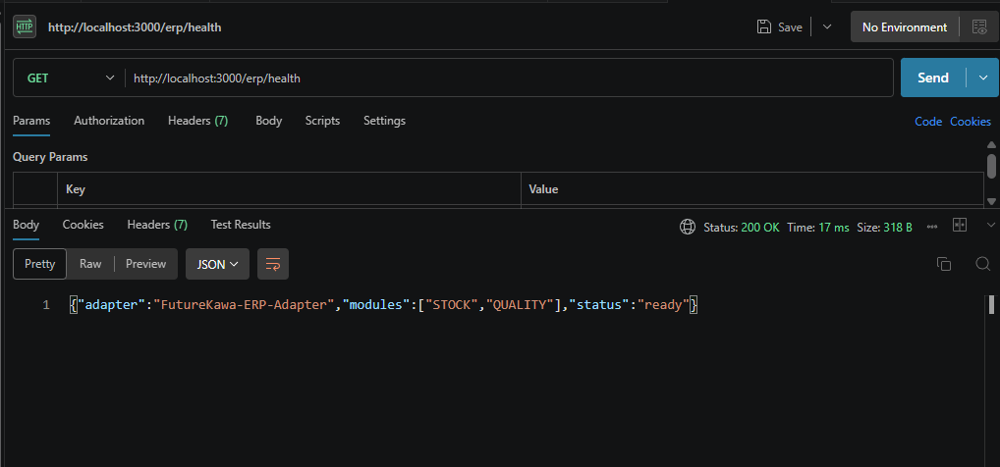

**Figure 20 - Endpoint `/erp/health` exposant l'état du connecteur ERP FutureKawa.**


**Figure 21 - Endpoint `/erp/stock-movements` exposant les lots dans un format exploitable par un module stock.**

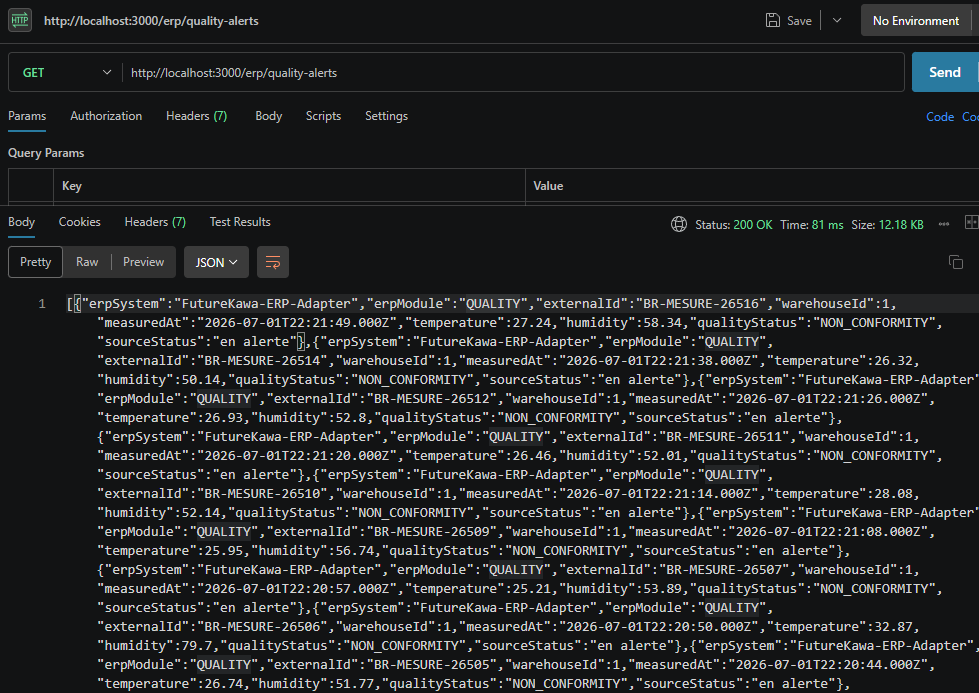

**Figure 22 - Endpoint `/erp/quality-alerts` exposant les non-conformités qualité dans un format ERP.**

Le projet valide donc partiellement le point ERP de la grille : il matérialise les flux et le mapping métier, mais il ne remplace pas un développement dans un vrai progiciel intégré. Cette limite est assumée et documentée pour éviter toute confusion pendant la soutenance.

<div style="page-break-after: always;"></div>

# 21. Validation détaillée du sujet

| Livrable du sujet | Statut | Preuve |
| --- | --- | --- |
| Backend pays conteneurisé | Validé | `api_brazil`, `api_colombia`, `api_ecuador` |
| API REST pays | Validé | routes lots, mesures, entrepôts, exploitations |
| Base SQL | Validé | MySQL par pays |
| Broker MQTT | Validé | `mqtt_broker` Mosquitto |
| Alertes et e-mail | Validé | service notification log/SMTP |
| Docker Compose | Validé | `docker-compose.yml` |
| Backend central siège | Validé | `api_central` |
| Frontend web siège | Validé | React sur port 8080 |
| Sélection pays/exploitation | Validé | Dashboard + pages |
| Lots triables/consultables | Validé | page Entrepôts + API lots |
| Courbes température/humidité | Validé | page Exploitations |
| Prototype IoT | Validé | ESP32 + DHT11 + MicroPython |
| MQTT vers backend | Validé | mqtt_bridge |
| Dossier technique | Validé | `docs/architecture/dossier_technique.md` |
| Plan de tests | Validé | `docs/tests/plan_de_tests.md` |
| Jenkins | Validé | `Jenkinsfile` |
| Tests automatisés | Validé | `country/api/test/run-tests.ts` |
| Tests manuels | Validé | commandes documentées |
| Anomalies et re-tests | Validé | `docs/tests/anomalies_retests.md` |
| Module ERP | Validé au niveau POC | adaptateur ERP simulé `country/api/src/erp` |
| Repository Git | Validé | commits et branche poussée |
| Documentation utilisateur | Validé | section utilisateur + docs |
| Schéma phase 2 | Validé | section automatisation |
| Questionnaire phase 2 | Validé | `docs/cadrage/questionnaire_phase_2.md` |

## 21.1 Points particulièrement forts

- le flux IoT complet est présent ;
- les trois pays sont désormais représentés ;
- l'alerte SMTP réelle a été testée ;
- le graphe a été corrigé pour être lisible ;
- un module ERP stock/qualité est présent ;
- des tests automatisés couvrent les règles métier critiques ;
- les exports ERP sont protégés par clé API et rôle ;
- le suivi anomalie/correction/re-test est formalisé ;
- le rapport inclut des preuves visuelles ;
- le projet est lançable par Docker Compose ;
- Jenkins est prêt.

## 21.2 Points de vigilance

Certains éléments restent à considérer dans une version industrialisée :

- remplacer la clé API ERP par une authentification JWT ou SSO complète ;
- ajouter une supervision centralisée des services ;
- historiser plus finement les événements d'exploitation ;
- étendre les tests automatisés jusqu'à l'E2E navigateur ;
- connecter le module ERP à un progiciel réel ;
- documenter les procédures d'exploitation en production.

<div style="page-break-after: always;"></div>

# 22. Validation détaillée de la grille

Le tableau ci-dessous reprend les compétences de la grille avec un niveau estimé réaliste. L'objectif n'est pas d'affirmer que tout vaut 3/3, mais de montrer ce qui est prouvé, ce qui est partiel, et l'action corrective prévue.

| Compétence | Réalisation | Preuve | Niveau estimé | Limite | Action corrective |
| --- | --- | --- | --- | --- | --- |
| Collecter et restituer les besoins | Analyse du sujet, acteurs métiers, questionnaire-type, besoins classés et priorisés | Section 3.5, `docs/cadrage/questionnaire_phase_2.md` | Élevé | Entretiens simulés, pas de vrais utilisateurs FutureKawa | Faire valider le questionnaire par des responsables métier réels |
| Concevoir une architecture applicative | Architecture pays + siège, APIs, MySQL par pays, MQTT, Docker Compose | Schéma d'architecture, `docker-compose.yml`, dossier technique | Élevé | Pas de haute disponibilité ni cloud réel | Ajouter supervision, sauvegardes, déploiement cloud |
| Développer une application adaptée | Frontend React, APIs NestJS, module IoT ESP32/DHT11 MicroPython, MQTT bridge | Code `central/`, `country/`, `iot/`, captures UI/Thonny | Élevé | Pas d'application mobile native | Garder le responsive web ou ajouter mobile si demandé |
| Développer une solution intégrée / ERP | Adaptateur ERP simulé stock/qualité avec exports JSON, sécurité par clé API et rôle | `country/api/src/erp`, `docs/erp/progiciel_integre.md`, captures ERP | Partiel à intermédiaire | Pas de SAP/Dynamics/Salesforce réel, pas d'ABAP/X++/Apex | Brancher un ERP réel ou développer le module dans le langage du progiciel cible |
| Effectuer les tests | Plan de tests, tests automatisés métier/ERP, tests manuels API/MQTT/UI, anomalies et re-tests | `country/api/test/run-tests.ts`, `docs/tests/*`, logs Jenkins | Intermédiaire à élevé | Pas de suite E2E navigateur automatisée stable | Ajouter Playwright/Cypress en CI avec environnement de test contrôlé |
| Appliquer l'intégration continue | Pipeline Jenkins avec validation Docker Compose, tests, builds API/frontend/bridge et artefacts | `Jenkinsfile`, captures Jenkins vertes | Intermédiaire à élevé | Pas de SonarQube ni rapport de couverture | Ajouter qualité de code, couverture et publication d'artefacts versionnés |
| Rédiger la documentation | Rapport complet, README, documentation technique, utilisateur, IoT, tests et CI | `docs/`, présent rapport, captures | Élevé | Le PDF dépend des captures disponibles | Mettre à jour le PDF final après chaque nouvelle preuve |
| Conduire le changement | Axes informer, communiquer, former, faire participer + modèle de William Bridges | Section 18, `docs/changement/plan_conduite_changement.md` | Élevé | Pas de mesure d'adoption réelle | Lancer un pilote et mesurer satisfaction/utilisation |
| Sécurité | Exports ERP protégés par clé API et rôle, variables d'environnement, séparation Docker | Guard API key/rôle, configuration Docker Compose | Intermédiaire | Pas de JWT complet, HTTPS, rate limit ou audit centralisé | Ajouter JWT/SSO, HTTPS, rate limiting et journal d'audit |

<div style="page-break-after: always;"></div>

# 23. Annexes techniques

## 23.1 Arborescence importante

```text
central/
  api/      API centrale siège
  app/      Frontend React

country/
  api/      API pays réutilisée
  init.sql  Schéma SQL

iot/
  esp32-dht11/micropython/  Code ESP32 MicroPython
  mqtt/                     Configuration Mosquitto
  mqtt-bridge/              Bridge Python

docs/
  architecture/
  alerts/
  cadrage/
  changement/
  ci/
  tests/
  rendu/

docker-compose.yml
Jenkinsfile
```

## 23.2 Fichiers clés

| Fichier | Rôle |
| --- | --- |
| `docker-compose.yml` | Orchestration complète |
| `Jenkinsfile` | Pipeline CI |
| `country/api/src/mesures/mesures.service.ts` | Calcul statut mesure |
| `country/api/src/alerts/alert-notification.service.ts` | E-mail/log alerte |
| `iot/mqtt-bridge/bridge.py` | MQTT vers API |
| `iot/esp32-dht11/micropython/main_mqtt.py` | Code ESP32 |
| `central/app/src/page/Exploitations/StatsCard/StatsCard.tsx` | Graphe lisible |

## 23.3 Endpoints de démonstration

```text
Frontend : http://localhost:8080
API centrale : http://localhost:3001
API Brazil : http://localhost:3000
API Colombia : http://localhost:3002
API Ecuador : http://localhost:3003
MQTT : localhost:1883
```

## 23.4 Commandes de seed Équateur

```powershell
docker compose exec -e SEED_TRUNCATE=true -e SEED_RANDOM_SEED=814 api_ecuador npm run seed
```

---

# Conclusion

Le projet FutureKawa répond au sujet MSPR TPRE814 en proposant une solution applicative complète, distribuée et démontrable. Il couvre le développement web, backend, IoT, la persistance SQL, l'architecture pays + siège, les alertes, les tests, Jenkins, la documentation et la conduite du changement.

Le projet n'est pas présenté comme une production finale sans limites. Il est présenté comme un POC avancé, cohérent, testable et extensible. Cette honnêteté est importante en soutenance : elle montre une compréhension réaliste du cycle de vie d'une solution informatique.

La démonstration doit insister sur le flux de bout en bout :

```text
ESP32/DHT11 ou test MQTT
  -> Mosquitto
  -> mqtt_bridge
  -> API pays
  -> MySQL
  -> API centrale
  -> React
  -> alerte et décision métier
```

C'est ce flux qui matérialise la valeur du projet : transformer une mesure terrain en information exploitable par un responsable métier.
