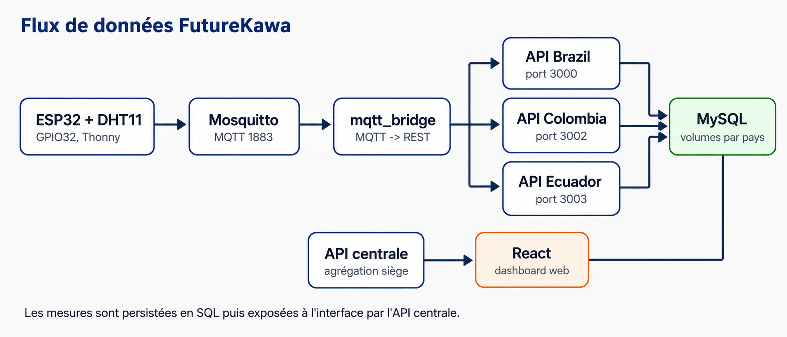
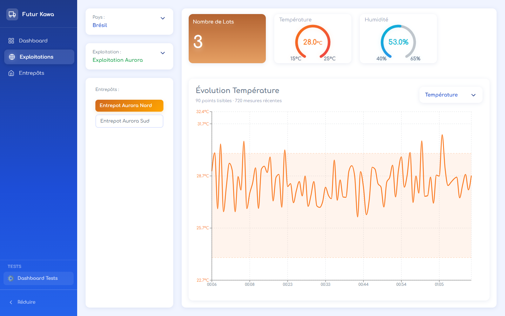
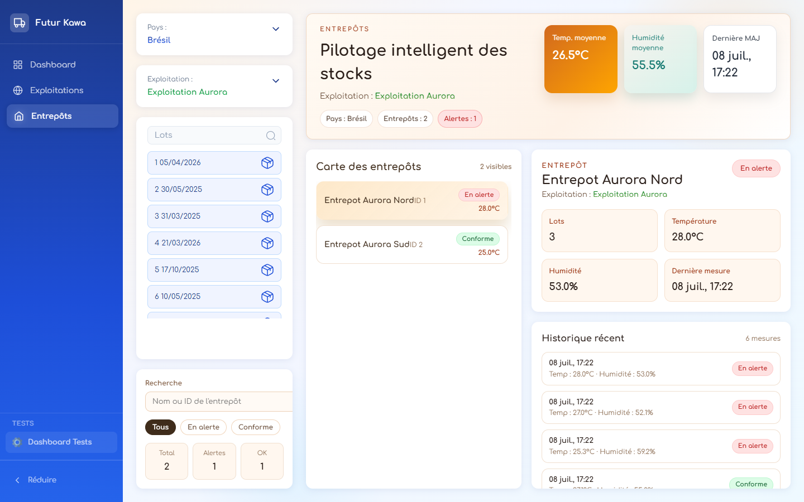
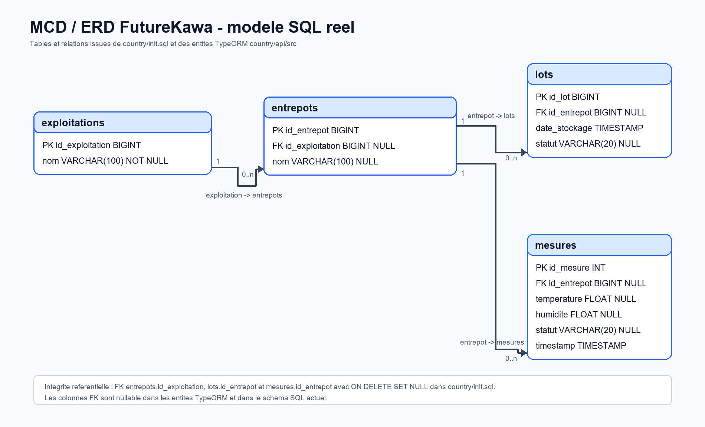
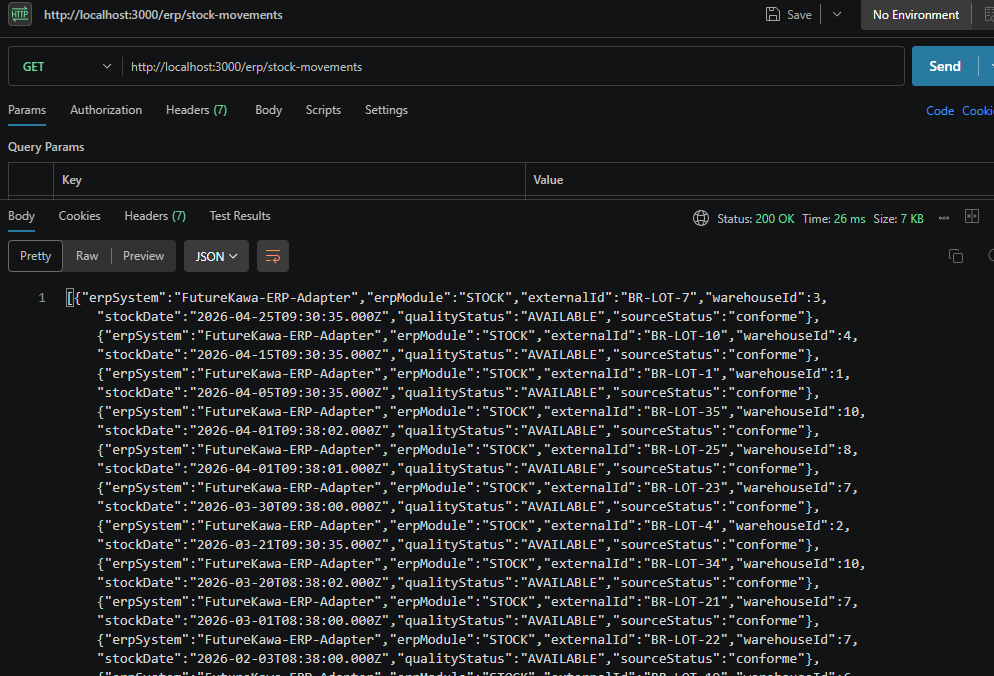
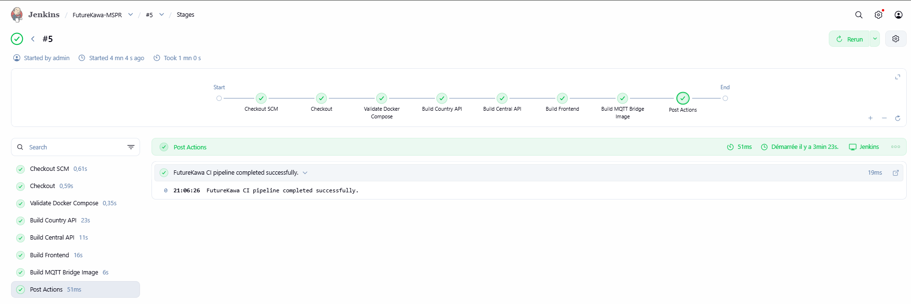
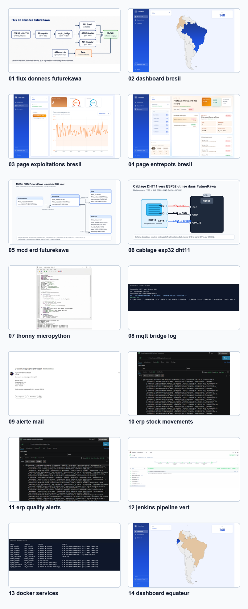

# Rapport de comprehension projet - FutureKawa MSPR TPRE814

Date de mise a jour : 8 juillet 2026

Equipe projet : Thibault AUTEXIER, Issam HARNOUFI, Zaid ABABOU, Ali WARI

Objectif du document : permettre a un membre de l'equipe de comprendre rapidement le projet, de le lancer, de le tester, de retrouver les bons fichiers et de savoir comment les differentes parties communiquent entre elles.

---

## 1. Resume rapide

FutureKawa est une application de supervision de stocks de cafe et de conditions de stockage.

Le projet suit des lots de cafe dans des entrepots, surveille la temperature et l'humidite avec un flux IoT, declenche des alertes si les valeurs sortent des seuils, et expose les donnees dans une interface web.

Le projet contient :

- une interface web React pour le siege ;
- une API centrale NestJS qui agrege les pays ;
- une API pays NestJS reutilisee pour Bresil, Colombie et Equateur ;
- trois bases MySQL, une par pays ;
- un broker MQTT Mosquitto ;
- un bridge MQTT vers API REST ;
- un simulateur IoT Docker ;
- un script MicroPython ESP32 + DHT11 ;
- un module d'export ERP ;
- des tests automatises ;
- un pipeline Jenkins.

Schema global :



---

## 2. Probleme metier

FutureKawa doit superviser ses stocks de cafe dans plusieurs pays. Le besoin principal est de savoir :

- ou sont les lots ;
- dans quel entrepot ils sont stockes ;
- si les conditions de stockage sont correctes ;
- si une alerte temperature ou humidite existe ;
- quelles donnees peuvent etre remontees a un systeme de gestion type ERP.

Le projet repond donc a deux logiques :

1. Logique metier : exploitations, entrepots, lots, mesures, alertes.
2. Logique technique : IoT, MQTT, API, base SQL, interface web, CI/CD.

---

## 3. Architecture generale

Le projet est decoupe en blocs simples :

| Bloc | Role |
| --- | --- |
| `central/app` | Interface web React/Vite |
| `central/api` | API centrale qui route vers les APIs pays |
| `country/api` | API pays, reutilisee pour Brazil, Colombia, Ecuador |
| `country/init.sql` | Schema SQL commun aux bases pays |
| `iot/mqtt` | Configuration Mosquitto |
| `iot/mqtt-bridge` | Service Python qui ecoute MQTT et poste vers l'API |
| `iot/esp32-dht11` | Code materiel reel ESP32 + DHT11 |
| `simulator` | Simulateur IoT Docker |
| `docs` | Documentation, preuves, captures, rapport, presentation |
| `Jenkinsfile` | Pipeline Jenkins |
| `docker-compose.yml` | Orchestration complete |

Flux principal :

```text
ESP32 + DHT11
  -> WiFi
  -> Mosquitto MQTT
  -> mqtt_bridge
  -> API pays Brazil
  -> MySQL Brazil
  -> API centrale
  -> Frontend React
```

Flux avec simulateur :

```text
iot_simulator
  -> POST http://api_brazil:3000/mesures
  -> API pays Brazil
  -> MySQL Brazil
  -> API centrale
  -> Frontend React
```

---

## 4. Services Docker

Le fichier principal est `docker-compose.yml`.

Services importants :

| Service | Port local | Role |
| --- | ---: | --- |
| `app_central` | `8080` | Interface web |
| `api_central` | `3001` | API siege / multi-pays |
| `api_brazil` | `3000` | API pays Bresil |
| `api_colombia` | `3002` | API pays Colombie |
| `api_ecuador` | `3003` | API pays Equateur |
| `mysql_Brazil` | `3307` | Base Bresil |
| `mysql_Colombia` | `3308` | Base Colombie |
| `mysql_Ecuador` | `3309` | Base Equateur |
| `mqtt_broker` | `1883` | Broker MQTT |
| `mqtt_bridge` | interne | Bridge MQTT vers API |
| `iot_simulator` | interne | Simulation de mesures |

Commande de demarrage complete :

```powershell
docker compose --profile dev up --build -d
```

Verifier les conteneurs :

```powershell
docker compose --profile dev ps
```

Arreter le projet :

```powershell
docker compose --profile dev down
```

Arreter et supprimer aussi les volumes SQL :

```powershell
docker compose --profile dev down -v
```

Attention : `down -v` supprime les donnees MySQL persistantes.

---

## 5. Comment lancer le projet

Depuis PowerShell :

```powershell
cd "C:\Users\reyis\Desktop\Projects\MSPR-TPRE814-Application-IoT-Stock"
docker compose --profile dev up --build -d
```

Ensuite ouvrir :

```text
http://localhost:8080
```

API centrale :

```text
http://localhost:3001
```

API Bresil :

```text
http://localhost:3000
```

Voir les logs du simulateur :

```powershell
docker logs -f iot_simulator
```

Voir les logs du bridge MQTT :

```powershell
docker logs -f mqtt_bridge
```

Voir les logs API Bresil :

```powershell
docker logs -f api_brazil
```

---

## 6. Interface web

L'interface est dans :

```text
central/app
```

Technologies :

- React ;
- Vite ;
- TypeScript ;
- Recharts pour les graphes ;
- CSS par composants.

### 6.1 Dashboard

Le dashboard affiche une carte d'Amerique du Sud et permet de selectionner un pays :

- Bresil ;
- Colombie ;
- Equateur.

Capture :


Fichier principal :

```text
central/app/src/page/Dashboard/Dashboard.tsx
```

Le pays selectionne est conserve dans le contexte :

```text
central/app/src/context/DashboardContext.tsx
```

### 6.2 Page Exploitations

La page Exploitations permet de :

- choisir un pays ;
- choisir une exploitation ;
- choisir un entrepot ;
- voir le nombre de lots ;
- voir la derniere temperature ;
- voir la derniere humidite ;
- voir l'evolution dans un graphe.

Capture :



Fichier principal :

```text
central/app/src/page/Exploitations/Exploitations.tsx
```

Le graphe a ete corrige pour rester lisible avec beaucoup de mesures. La solution appliquee est :

- limitation du nombre de points affiches ;
- regroupement en intervalles ;
- moyenne par intervalle ;
- domaine Y adapte ;
- affichage temperature/humidite selon la selection.

### 6.3 Page Entrepots

La page Entrepots permet de :

- lister les entrepots ;
- filtrer par statut ;
- rechercher par nom ou ID ;
- voir temperature, humidite, derniere mesure ;
- consulter les mesures recentes ;
- voir les entrepots en alerte.

Capture :



Fichier principal :

```text
central/app/src/page/Entrepots/Entrepots.tsx
```

Le scroll horizontal disgracieux a ete corrige dans le CSS de cette page.

---

## 7. API centrale

Dossier :

```text
central/api
```

Role :

- recevoir les appels du frontend ;
- savoir quel pays est demande ;
- forwarder la requete vers la bonne API pays ;
- rendre le frontend independant des URLs directes de chaque pays.

Exemple :

```text
GET http://localhost:3001/brazil/exploitations
```

L'API centrale transmet vers :

```text
http://api_brazil:3000/exploitations
```

Pays geres :

| Pays interface | Code API | Service Docker |
| --- | --- | --- |
| Bresil | `brazil` | `api_brazil` |
| Colombie | `colombia` | `api_colombia` |
| Equateur | `ecuador` | `api_ecuador` |

Routes principales :

```text
GET    /:country/exploitations
GET    /:country/exploitations/:id
POST   /:country/exploitations
PUT    /:country/exploitations/:id
DELETE /:country/exploitations/:id

GET    /:country/entrepots
GET    /:country/entrepots/exploitation/:id
GET    /:country/entrepots/:id
POST   /:country/entrepots
PUT    /:country/entrepots/:id
DELETE /:country/entrepots/:id

GET    /:country/lots
GET    /:country/lots/entrepot/:id
GET    /:country/lots/:id
POST   /:country/lots
PUT    /:country/lots/:id
DELETE /:country/lots/:id

GET    /:country/mesures
GET    /:country/mesures/entrepot/:id/latest
GET    /:country/mesures/entrepot/:id
GET    /:country/mesures/:id
POST   /:country/mesures
```

---

## 8. API pays

Dossier :

```text
country/api
```

Cette API est construite une seule fois, puis instanciee trois fois dans Docker :

- `api_brazil` ;
- `api_colombia` ;
- `api_ecuador`.

Chaque instance utilise une base differente grace aux variables d'environnement.

Modules principaux :

| Module | Dossier | Role |
| --- | --- | --- |
| Exploitations | `src/exploitations` | CRUD exploitations |
| Entrepots | `src/entrepots` | CRUD entrepots |
| Lots | `src/lots` | CRUD lots et statut |
| Mesures | `src/mesures` | Mesures IoT et calcul alerte |
| Alerts | `src/alerts` | Notification email/log |
| ERP | `src/erp` | Exports ERP stock/qualite |
| Security | `src/security` | Cle API et roles ERP |
| Dataset | `src/dataset` | Import du jeu de donnees |

Routes directes API pays :

```text
GET    /exploitations
GET    /exploitations/:id
POST   /exploitations
PUT    /exploitations/:id
DELETE /exploitations/:id

GET    /entrepots
GET    /entrepots/exploitation/:id
GET    /entrepots/:id
POST   /entrepots
PUT    /entrepots/:id
DELETE /entrepots/:id

GET    /lots
GET    /lots/expired
GET    /lots/entrepot/:id
GET    /lots/:id
POST   /lots
PUT    /lots/:id
DELETE /lots/:id

GET    /mesures
GET    /mesures/entrepot/:id/latest
GET    /mesures/entrepot/:id
GET    /mesures/alerts
GET    /mesures/:id
POST   /mesures
```

Exemple de mesure manuelle :

```powershell
Invoke-RestMethod -Method Post -Uri "http://localhost:3000/mesures" -ContentType "application/json" -Body '{"id_entrepot":1,"temperature":26.5,"humidite":55}'
```

Exemple de mesure en alerte :

```powershell
Invoke-RestMethod -Method Post -Uri "http://localhost:3000/mesures" -ContentType "application/json" -Body '{"id_entrepot":1,"temperature":34,"humidite":84}'
```

Verifier la derniere mesure :

```powershell
Invoke-RestMethod -Uri "http://localhost:3000/mesures/entrepot/1/latest"
```

---

## 9. Base de donnees

Schema SQL :

```text
country/init.sql
```

Documentation :

```text
docs/database/modele_de_donnees.md
docs/database/import_jeu_de_donnees.md
docs/database/mcd_futurekawa.png
```

Diagramme :



Tables :

| Table | Role |
| --- | --- |
| `exploitations` | Exploitations cafeieres |
| `entrepots` | Entrepots rattaches a une exploitation |
| `lots` | Lots de cafe stockes |
| `mesures` | Historique temperature/humidite |

Relations :

```text
exploitations 1 -> n entrepots
entrepots 1 -> n lots
entrepots 1 -> n mesures
```

Les cles etrangeres sont configurees avec `ON DELETE SET NULL`. Cela permet de conserver l'historique meme si un entrepot ou une exploitation est supprime.

Ports MySQL :

| Pays | Base | Port local |
| --- | --- | ---: |
| Bresil | `brazil_db` | `3307` |
| Colombie | `colombia_db` | `3308` |
| Equateur | `ecuador_db` | `3309` |

Verifier les donnees :

```powershell
docker exec mysql_Brazil mysql -uroot -proot brazil_db -e "SELECT COUNT(*) AS mesures FROM mesures;"
docker exec mysql_Brazil mysql -uroot -proot brazil_db -e "SELECT * FROM mesures ORDER BY timestamp DESC LIMIT 5;"
```

---

## 10. Jeu de donnees

Le depot contient un dataset SQL dans :

```text
docs/data_tests
```

Fichiers :

| Fichier | Role |
| --- | --- |
| `exploitations.sql` | Donnees exploitations |
| `entrepots.sql` | Donnees entrepots |
| `mesures.sql` | Donnees de mesures |

Importeur :

```text
country/api/src/dataset/import-data-tests.ts
```

Commande de validation sans ecrire en base :

```powershell
cd country/api
npm run dataset:import -- --dry-run
```

Import reel dans la base Colombie :

```powershell
cd country/api
$env:DB_HOST="localhost"
$env:DB_PORT="3308"
$env:DB_USER="root"
$env:DB_PASS="root"
$env:DB_NAME="colombia_db"
npm run dataset:import
```

Points importants :

- l'import est idempotent ;
- relancer l'import ne duplique pas les mesures ;
- certaines lignes peuvent etre rejetees si elles pointent vers un entrepot absent ;
- le statut des mesures est recalcule par l'application.

---

## 11. Regles d'alerte

Une mesure contient :

```json
{
  "id_entrepot": 1,
  "temperature": 26.5,
  "humidite": 55
}
```

L'API calcule ensuite le statut :

- `conforme` si temperature et humidite sont dans les seuils ;
- `en alerte` si au moins une valeur sort des seuils.

Seuils par pays :

| Pays | Temperature cible | Humidite cible | Tolerance |
| --- | ---: | ---: | --- |
| Bresil | `29 C` | `55 %` | `+/- 3 C`, `+/- 2 %` |
| Colombie | `26 C` | `80 %` | `+/- 3 C`, `+/- 2 %` |
| Equateur | `31 C` | `60 %` | `+/- 3 C`, `+/- 2 %` |

Exemple Bresil :

| Valeur | Statut |
| --- | --- |
| `temperature=29`, `humidite=55` | conforme |
| `temperature=32`, `humidite=57` | conforme |
| `temperature=32.1`, `humidite=55` | en alerte |
| `temperature=29`, `humidite=52.9` | en alerte |

Service concerne :

```text
country/api/src/mesures/mesure-status.ts
```

Alertes email/log :

```text
country/api/src/alerts/alert-notification.service.ts
```

Capture mail :


Mode par defaut :

```env
ALERT_EMAIL_MODE=log
```

En mode `log`, le contenu de l'email apparait dans les logs Docker. En mode `smtp`, l'API envoie un vrai mail via un serveur SMTP.

---

## 12. IoT reel : ESP32 + DHT11

Dossier :

```text
iot/esp32-dht11
```

Materiel utilise :

- ESP32 ;
- capteur DHT11 temperature/humidite ;
- MicroPython ;
- Thonny IDE.

Cablage :

| DHT11 | ESP32 |
| --- | --- |
| VCC / + | 3V3 |
| GND / - | GND |
| OUT / DATA | GPIO32 |

Schema :


Script principal MQTT :

```text
iot/esp32-dht11/micropython/main_mqtt.py
```

Configuration :

```text
iot/esp32-dht11/micropython/config.example.py
```

Le fichier `config.example.py` doit etre copie en `config.py`, puis adapte :

```python
WIFI_SSID = "NOM_WIFI"
WIFI_PASSWORD = "MOT_DE_PASSE"
MQTT_BROKER = "IP_DU_PC"
MQTT_PORT = 1883
MQTT_TOPIC = "futurekawa/mesures"
ENTREPOT_ID = 1
DHT_PIN = 32
```

Important : l'ESP32 ne peut pas utiliser `localhost`. Il doit utiliser l'adresse IPv4 du PC sur le meme reseau.

Dans Thonny :

1. choisir l'interpreteur `MicroPython (ESP32)` ;
2. selectionner le port COM de l'ESP32 ;
3. copier `config.py` sur la carte ;
4. copier `main_mqtt.py` sur la carte sous le nom `main.py` ;
5. redemarrer l'ESP32.

Capture Thonny :


Resultat attendu dans Thonny :

```text
FutureKawa ESP32 + DHT11 MicroPython MQTT
WiFi connected: ...
MQTT connected: ... 1883
published: {"id_entrepot":1,"temperature":26,"humidite":55}
```

---

## 13. MQTT

Dossiers :

```text
iot/mqtt
iot/mqtt-bridge
```

MQTT sert a relier le monde IoT au backend.

Topic :

```text
futurekawa/mesures
```

Payload :

```json
{"id_entrepot":1,"temperature":26.5,"humidite":55}
```

Le service `mqtt_bridge` :

1. se connecte au broker Mosquitto ;
2. ecoute le topic `futurekawa/mesures` ;
3. parse le message ;
4. envoie un `POST /mesures` vers l'API Bresil ;
5. log le statut HTTP.

Capture :


Test MQTT sans ESP32 :

```powershell
docker exec mqtt_broker mosquitto_pub -h localhost -p 1883 -t futurekawa/mesures -m "{id_entrepot:1,temperature:26.5,humidite:55}"
docker logs --tail 30 mqtt_bridge
```

Resultat attendu :

```text
mqtt: futurekawa/mesures ...
posted: 201 ...
```

---

## 14. Simulateur IoT

Dossier :

```text
simulator
```

Le simulateur permet de faire fonctionner la demonstration sans carte ESP32.

Il envoie regulierement des mesures vers :

```text
http://api_brazil:3000/mesures
```

Variables utiles :

| Variable | Role |
| --- | --- |
| `SIMULATOR_API_URL` | URL API cible |
| `SIMULATOR_ENTREPOT_ID` | Entrepot cible |
| `SIMULATOR_INTERVAL_MS` | Intervalle entre mesures |
| `SIMULATOR_MODE` | Mode des valeurs : normales, alertes, mixtes |

Voir les donnees envoyees :

```powershell
docker logs -f iot_simulator
```

Stopper seulement le simulateur :

```powershell
docker compose stop iot_simulator
```

C'est utile quand on veut que seules les donnees ESP32 reelles arrivent.

---

## 15. Module ERP

Dossier :

```text
country/api/src/erp
```

Objectif : montrer comment FutureKawa pourrait exposer des donnees vers un progiciel integre de type SAP, Microsoft Dynamics ou Salesforce.

Le projet ne contient pas un ERP reel, mais un adaptateur ERP simule qui expose des flux metier propres :

| Route | Role |
| --- | --- |
| `GET /erp/health` | Verifier le module ERP |
| `GET /erp/stock-movements` | Export des lots / stock |
| `GET /erp/quality-alerts` | Export des mesures en non-conformite |

Securite :

| Route | Header role |
| --- | --- |
| `/erp/stock-movements` | `x-user-role: stock` ou `admin` |
| `/erp/quality-alerts` | `x-user-role: quality` ou `admin` |

Header commun :

```text
x-api-key: futurekawa-demo-key
```

Exemple Postman stock :



Exemple Postman qualite :


Exemple PowerShell :

```powershell
Invoke-RestMethod -Uri "http://localhost:3000/erp/stock-movements" -Headers @{"x-api-key"="futurekawa-demo-key";"x-user-role"="stock"}
```

```powershell
Invoke-RestMethod -Uri "http://localhost:3000/erp/quality-alerts" -Headers @{"x-api-key"="futurekawa-demo-key";"x-user-role"="quality"}
```

Si les headers sont absents ou incorrects, l'API doit refuser l'acces.

---

## 16. Securite

La securite la plus concrete du projet est sur le module ERP :

- cle API ;
- role `stock`, `quality` ou `admin` ;
- guard NestJS ;
- refus des appels non autorises.

Fichiers :

```text
country/api/src/security/api-key-role.guard.ts
country/api/src/security/roles.decorator.ts
```

Variables :

```env
ERP_API_KEY=futurekawa-demo-key
```

Limites connues :

- pas de JWT complet ;
- pas de gestion utilisateurs frontend ;
- pas de HTTPS local ;
- pas d'audit logs avances ;
- pas de rate limiting.

Pour un POC MSPR, la cle API + roles montre deja la logique d'autorisation sur les exports sensibles.

---

## 17. Tests

Documentation :

```text
docs/tests/strategie_tests_automatises.md
docs/tests/plan_de_tests.md
docs/tests/anomalies_retests.md
```

Tests automatises :

```text
country/api/test/run-tests.ts
```

Commande :

```powershell
cd country/api
npm test
```

Ce qui est teste automatiquement :

- calcul des seuils ;
- statut `conforme` ou `en alerte` ;
- mapping ERP stock ;
- mapping ERP qualite ;
- parsing du dataset ;
- rejet des lignes invalides ;
- idempotence de l'import.

Tests manuels importants :

```powershell
docker compose --profile dev up --build -d
Invoke-RestMethod -Method Post -Uri "http://localhost:3000/mesures" -ContentType "application/json" -Body '{"id_entrepot":1,"temperature":34,"humidite":84}'
Invoke-RestMethod -Uri "http://localhost:3000/mesures/entrepot/1/latest"
```

Test interface :

1. ouvrir `http://localhost:8080` ;
2. choisir Bresil ;
3. aller dans Exploitations ;
4. choisir une exploitation et un entrepot ;
5. verifier temperature, humidite, graphe et alertes ;
6. aller dans Entrepots ;
7. verifier les cartes, filtres et historique.

---

## 18. Jenkins

Fichier :

```text
Jenkinsfile
```

Capture :



Stages :

1. checkout ;
2. validation Docker Compose ;
3. installation dependances API pays ;
4. tests automatises API pays ;
5. build API pays ;
6. build API centrale ;
7. build frontend ;
8. build image MQTT bridge ;
9. archivage des artefacts.

Prerequis Jenkins :

- Git ;
- Node.js ;
- npm ;
- Docker ;
- Docker Compose plugin.

Commande locale equivalente :

```powershell
docker compose --profile dev config --quiet
cd country/api
npm ci
npm test
npm run build
cd ../../central/api
npm ci
npm run build
cd ../app
npm ci
npm run build
cd ../../
docker compose --profile dev build mqtt_bridge
```

---

## 19. Captures et presentation

Les images propres pour la soutenance sont dans :

```text
docs/rendu/presentation_images
```

Vue generale :



Presentation propre :

```text
docs/rendu/MSPR_TPRE814_Thibault AUTEXIER - Issam HARNOUFI - Zaid ABABOU - Ali WARI_presentation_clean_images.pptx
```

Rapport PDF final :

```text
docs/rendu/MSPR_TPRE814_Thibault AUTEXIER - Issam HARNOUFI - Zaid ABABOU - Ali WARI.pdf
```

Images a eviter :

- `docs/capture/ESP8266.jpg` : mauvaise carte pour la version finale ESP32 ;
- `docs/capture/image2.avif` : ancien diagramme moins propre.

---

## 20. Commandes utiles au quotidien

Demarrer :

```powershell
docker compose --profile dev up --build -d
```

Voir les services :

```powershell
docker compose --profile dev ps
```

Arreter :

```powershell
docker compose --profile dev down
```

Rebuild uniquement API Bresil :

```powershell
docker compose --profile dev up -d --build api_brazil
```

Logs API Bresil :

```powershell
docker logs -f api_brazil
```

Logs frontend :

```powershell
docker logs -f app_central
```

Logs MQTT :

```powershell
docker logs -f mqtt_bridge
```

Tester API centrale :

```powershell
Invoke-RestMethod -Uri "http://localhost:3001/brazil/exploitations"
Invoke-RestMethod -Uri "http://localhost:3001/colombia/exploitations"
Invoke-RestMethod -Uri "http://localhost:3001/ecuador/exploitations"
```

Tester API pays :

```powershell
Invoke-RestMethod -Uri "http://localhost:3000/exploitations"
Invoke-RestMethod -Uri "http://localhost:3000/entrepots"
Invoke-RestMethod -Uri "http://localhost:3000/lots"
Invoke-RestMethod -Uri "http://localhost:3000/mesures"
```

Tester une alerte :

```powershell
Invoke-RestMethod -Method Post -Uri "http://localhost:3000/mesures" -ContentType "application/json" -Body '{"id_entrepot":1,"temperature":34,"humidite":84}'
docker logs --tail 50 api_brazil
```

---

## 21. Structure des fichiers a connaitre

### Frontend

```text
central/app/src/page/Dashboard/Dashboard.tsx
central/app/src/page/Exploitations/Exploitations.tsx
central/app/src/page/Exploitations/StatsCard/StatsCard.tsx
central/app/src/page/Entrepots/Entrepots.tsx
central/app/src/context/DashboardContext.tsx
```

### API centrale

```text
central/api/src/app.module.ts
central/api/src/exploitations
central/api/src/entrepots
central/api/src/lots
central/api/src/mesures
```

### API pays

```text
country/api/src/app.module.ts
country/api/src/exploitations
country/api/src/entrepots
country/api/src/lots
country/api/src/mesures
country/api/src/alerts
country/api/src/erp
country/api/src/security
country/api/src/dataset
```

### IoT

```text
iot/esp32-dht11/micropython/main_mqtt.py
iot/esp32-dht11/micropython/config.example.py
iot/mqtt/mosquitto.conf
iot/mqtt-bridge/bridge.py
simulator/index.js
```

### Documentation

```text
docs/architecture/dossier_technique.md
docs/database/modele_de_donnees.md
docs/database/import_jeu_de_donnees.md
docs/erp/progiciel_integre.md
docs/alerts/email_alerts.md
docs/tests/plan_de_tests.md
docs/tests/strategie_tests_automatises.md
docs/tests/anomalies_retests.md
docs/ci/jenkins.md
```

---

## 22. Comment ajouter ou modifier une fonctionnalite

### Ajouter un champ en base

1. Modifier `country/init.sql`.
2. Modifier l'entite TypeORM correspondante dans `country/api/src/.../*.entity.ts`.
3. Modifier les DTO si le champ est recu en POST/PUT.
4. Modifier le service.
5. Modifier le frontend si le champ doit etre affiche.
6. Rebuild Docker.

### Ajouter une route API pays

1. Ajouter la methode dans le controller du module pays.
2. Ajouter la logique dans le service.
3. Ajouter un test si c'est une regle metier.
4. Si le frontend doit l'utiliser, ajouter aussi la route dans l'API centrale.

### Ajouter une donnee visible dans le frontend

1. Verifier que l'API pays expose la donnee.
2. Verifier que l'API centrale forwarde la route.
3. Ajouter le `fetch` dans la page ou le composant React.
4. Ajouter l'etat React necessaire.
5. Ajuster le CSS.

### Ajouter un pays

1. Ajouter une base MySQL dans `docker-compose.yml`.
2. Ajouter une instance `api_<pays>`.
3. Ajouter l'URL dans `api_central`.
4. Ajouter le mapping pays dans le frontend.
5. Ajouter les seuils temperature/humidite.
6. Tester `/:country/exploitations`.

---

## 23. Pieges connus et solutions

| Probleme | Cause probable | Solution |
| --- | --- | --- |
| `Cannot GET /erp/health` sur `localhost:3000` | API pas demarree ou mauvais conteneur | `docker compose ps api_brazil`, puis logs |
| API en restart avec `Cannot find module dist/main.js` | Image ou volume ancien, build absent | `docker compose up -d --build api_brazil` |
| `Failed uploading: no upload port provided` Arduino | Port non selectionne | Choisir le port COM |
| `COM6 access denied` | Port serie deja utilise | Fermer Thonny/Serial Monitor/bridge |
| ESP32 publie pas | Mauvaise IP MQTT ou WiFi bloque | Utiliser IP du PC, meme reseau, hotspot si besoin |
| Frontend sans donnees | API centrale ou pays down | Tester `http://localhost:3001/brazil/exploitations` |
| Graph illisible | Trop de mesures brutes | Le projet regroupe les points dans le graphe |
| Jenkins `docker not found` | Jenkins n'a pas Docker | Installer Docker ou utiliser agent avec Docker |
| PowerPoint ne se regenere pas | Fichier ouvert et verrouille par Windows | Fermer PowerPoint avant de relancer le script |

---

## 24. Ce qui est termine

Fonctionnellement, le projet couvre :

- gestion des exploitations ;
- gestion des entrepots ;
- gestion des lots ;
- stockage des mesures ;
- calcul des alertes ;
- visualisation dashboard ;
- visualisation exploitations ;
- visualisation entrepots ;
- pays multiples ;
- Docker Compose ;
- simulateur IoT ;
- ESP32 + DHT11 en MicroPython ;
- MQTT ;
- bridge MQTT vers API ;
- emails/logs d'alerte ;
- export ERP simule ;
- securite simple API key + role ;
- tests automatises ;
- Jenkins ;
- documentation et captures.

---

## 25. Limites actuelles

Le projet reste un POC. Les limites a connaitre :

- pas d'authentification utilisateur complete sur le frontend ;
- pas de JWT/SSO ;
- pas de vrai ERP connecte en production ;
- pas de HTTPS local ;
- pas de dashboard administrateur pour configurer les seuils ;
- tests UI pas encore automatises dans Jenkins ;
- emails reels dependants d'un SMTP externe ;
- l'ESP32 depend du WiFi disponible.

Ces limites sont acceptables pour une demonstration MSPR, mais elles donnent des pistes d'evolution si le projet devait partir en production.

---

## 26. Parcours de demonstration conseille

Pour expliquer le projet a quelqu'un :

1. Montrer le schema de flux.
2. Lancer Docker.
3. Ouvrir le dashboard.
4. Selectionner Bresil.
5. Aller dans Exploitations.
6. Montrer temperature, humidite et graphe.
7. Aller dans Entrepots.
8. Montrer filtres, historique et statuts.
9. Poster une mesure en alerte via PowerShell.
10. Montrer l'alerte dans les logs et dans l'interface.
11. Publier une mesure MQTT sans ESP32.
12. Montrer le bridge `posted: 201`.
13. Montrer le module ERP dans Postman.
14. Montrer Jenkins vert.

Commandes demo rapides :

```powershell
docker compose --profile dev up --build -d
Invoke-RestMethod -Method Post -Uri "http://localhost:3000/mesures" -ContentType "application/json" -Body '{"id_entrepot":1,"temperature":34,"humidite":84}'
docker exec mqtt_broker mosquitto_pub -h localhost -p 1883 -t futurekawa/mesures -m "{id_entrepot:1,temperature:26.5,humidite:55}"
docker logs --tail 30 mqtt_bridge
```

---

## 27. Glossaire

| Terme | Definition |
| --- | --- |
| Exploitation | Site ou domaine de production du cafe |
| Entrepot | Lieu de stockage rattache a une exploitation |
| Lot | Stock de cafe entrepose |
| Mesure | Releve temperature/humidite |
| DHT11 | Capteur temperature/humidite |
| ESP32 | Microcontroleur WiFi utilise pour l'IoT |
| MQTT | Protocole publish/subscribe tres utilise en IoT |
| Broker | Serveur MQTT qui recoit et redistribue les messages |
| Bridge | Service qui convertit MQTT vers HTTP REST |
| API pays | API locale d'un pays |
| API centrale | API siege qui agrege les pays |
| ERP | Progiciel integre de gestion |
| CI | Integration continue |

---

## 28. Documents de reference

Pour aller plus loin :

- `README.md` : lancement rapide ;
- `docs/architecture/dossier_technique.md` : architecture technique ;
- `docs/database/modele_de_donnees.md` : base SQL ;
- `docs/database/import_jeu_de_donnees.md` : dataset ;
- `docs/api/api_documentation.md` : routes API ;
- `docs/alerts/email_alerts.md` : alertes ;
- `docs/erp/progiciel_integre.md` : ERP ;
- `docs/tests/plan_de_tests.md` : tests manuels ;
- `docs/tests/strategie_tests_automatises.md` : tests automatiques ;
- `docs/tests/anomalies_retests.md` : corrections et re-tests ;
- `iot/esp32-dht11/README.md` : ESP32 + DHT11 ;
- `iot/mqtt/README.md` : MQTT ;
- `docs/ci/jenkins.md` : Jenkins.

---

## 29. Conclusion

FutureKawa est une solution complete de supervision IoT appliquee aux stocks de cafe. La force du projet est son architecture de bout en bout :

```text
capteur ou simulateur -> MQTT/HTTP -> API pays -> MySQL -> API centrale -> interface web -> alertes/ERP/Jenkins
```

Pour reprendre le projet, le plus important est de comprendre que l'API pays est le coeur metier, que l'API centrale sert de routeur multi-pays, et que le frontend ne parle presque jamais directement aux APIs pays. Le flux IoT peut etre demontre soit avec l'ESP32 reel, soit avec MQTT sans materiel, soit avec le simulateur Docker.

Si un coequipier doit travailler vite, il doit commencer par :

1. lancer Docker ;
2. ouvrir le frontend ;
3. tester `POST /mesures` ;
4. lire `country/api/src/mesures` ;
5. lire `central/app/src/page/Exploitations` et `central/app/src/page/Entrepots` ;
6. verifier les tests avec `npm test`.
